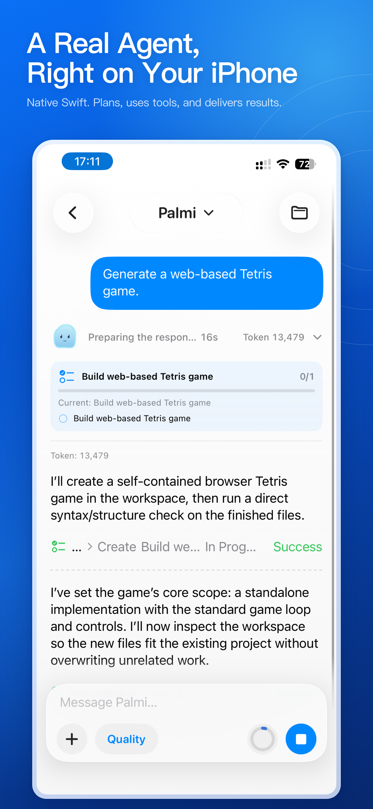
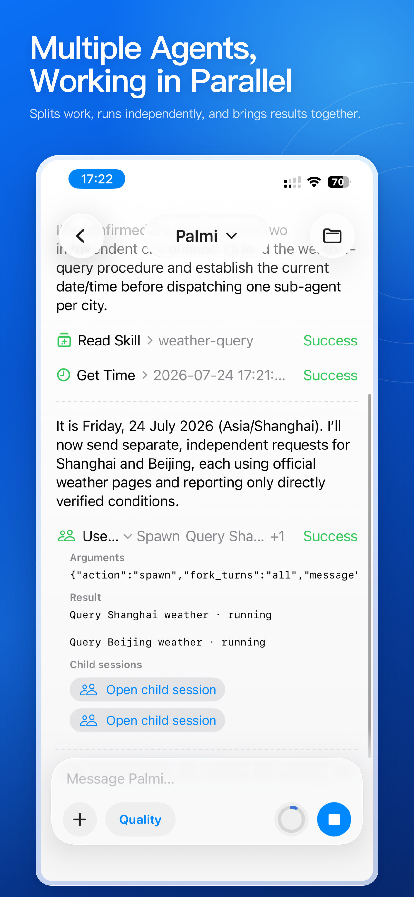
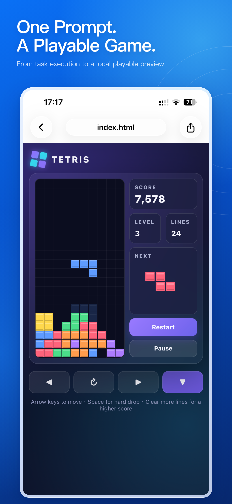
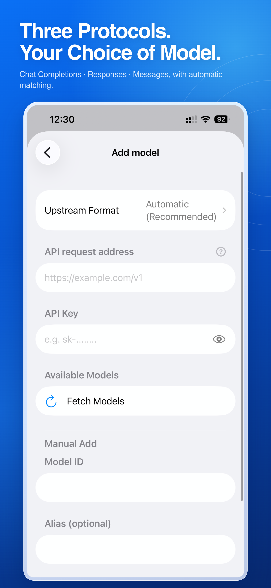
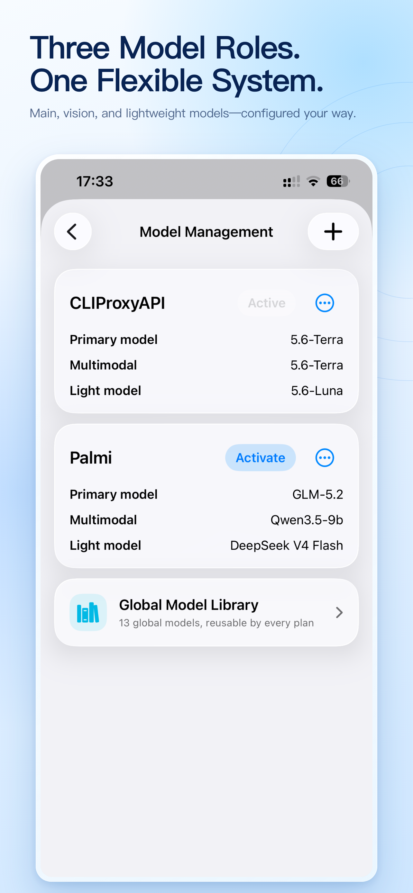
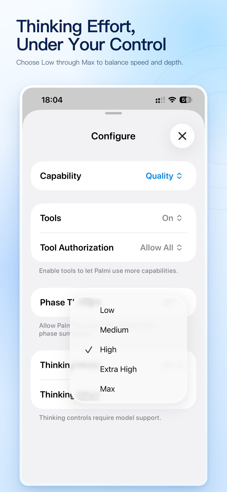
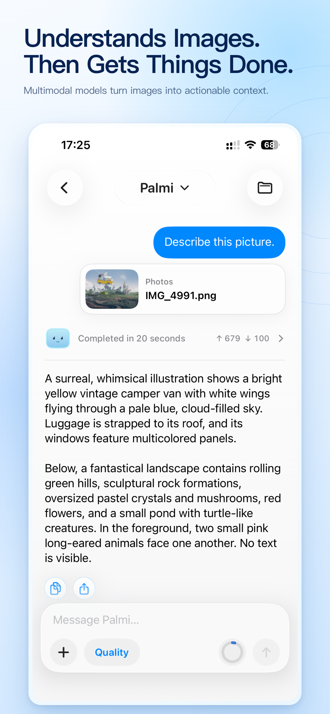
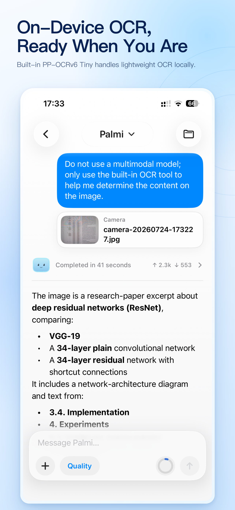
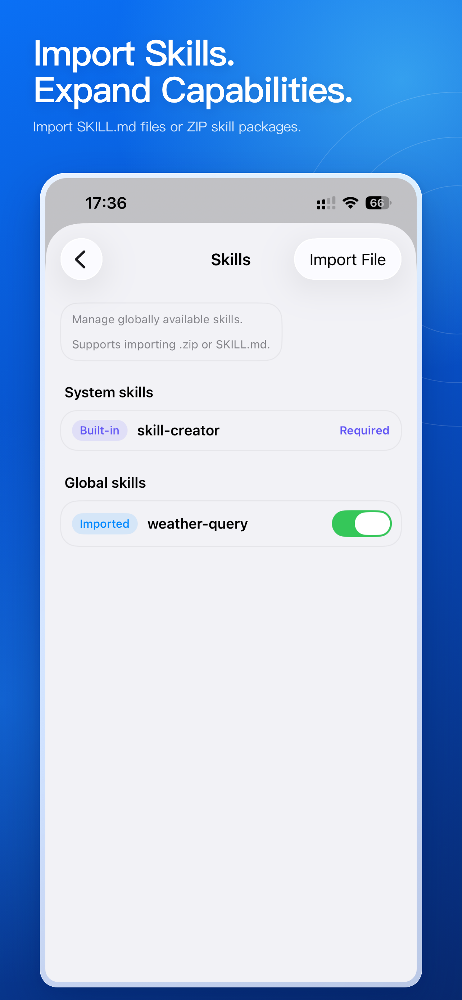

  <strong>English</strong> · <a href="README.zh-CN.md">简体中文</a>

<h1 align="center">
   
  PalmiAgent
</h1>

  <a href="https://apps.apple.com/us/app/palmiagent/id6787664658"><strong> Download free on the App Store</strong></a>

  <strong>Put AI to work, right on your iPhone.</strong> 
  A local-first, model-flexible, permission-aware personal AI agent workspace.

PalmiAgent goes beyond answering questions. It stays with a real task: understanding the goal, reading files, researching the web, using tools, running Python, creating deliverables, and keeping the entire conversation and its results together in your workspace.

You choose the models. PalmiAgent turns them into an agent that can actually get things done on the go.

  

## More than chat. Built to finish.

Most AI chats stop when the answer ends. PalmiAgent is designed for continued execution.

- **A complete agent loop:** analyzes the goal, plans the work, calls tools, reads the results, and keeps moving until it can deliver an answer or an artifact.
- **Three task styles inside a conversation:** use standard chat for everyday questions, Goal mode for multi-step outcomes, and Deep Research mode for evidence-heavy work.
- **Long-task continuity:** earlier context can be compacted while important task state is preserved. With background processing enabled, work may continue while the app is away or the device is locked, for as long as iOS allows.
- **Add ideas while it works:** new messages can wait in a queue and be delivered at the next safe point in the run.
- **A process you can inspect:** phase updates, tool calls, approvals, task state, evidence, file changes, timing, and token usage appear as structured records.

### Multiple agents, working in parallel

Complex work can be split among independent child agents while the primary agent coordinates the work and combines their findings.

  

### From one prompt to an interactive result

PalmiAgent can create self-contained HTML tools, visualizations, and browser games, then open and use them directly inside the app.

  

## Your models, your choice

PalmiAgent does not lock you into one AI provider, and it does not proxy your model requests through a PalmiAgent cloud.

### Bring your own endpoint

Connect your own API account or a model server on your local network. Choose **OpenAI Chat Completions, OpenAI Responses, or Anthropic Messages**, or use **automatic protocol matching**. Configure the service address, API key, and model to suit your provider.

Built-in setup is available for OpenAI, Azure OpenAI, GLM / Z.AI, DeepSeek, Qwen, Kimi, MiniMax, Doubao, Hunyuan, Qianfan, StepFun, ModelScope, SiliconFlow, OpenRouter, Ollama, and LM Studio. Other compatible services can be added manually.

  

### Three model roles, one flexible system

Assign separate **primary, multimodal, and lightweight model** roles to balance capability, speed, and cost. Save models in a global library, then reuse them across different plans and conversations.

  

### Tune the depth for each conversation

Discover remote model lists, enter model IDs manually, validate connections, switch plans per conversation, and control supported thinking modes and effort levels. API keys are stored in the system Keychain.

  

Use a flagship cloud model, a cost-efficient service, a private model on your LAN, or a mix of all three—the architecture stays yours.

## A workspace for every task

PalmiAgent turns chat from a disposable message stream into a project you can return to.

- **Two interface surfaces:** separate from the task styles above, **Chat mode** stays lightweight and direct, while **Professional mode** adds projects, conversations, files, and long-running task management.
- Conversations, attachments, web research, OCR output, Python logs, and generated artifacts remain attached to the active project and task.
- The agent can read, create, append, move, copy, rename, and organize workspace files.
- Browse folders, preview attachments and generated work, and export an entire project from the app.
- Break down PDF, Word, Excel, PowerPoint, Pages, Numbers, Keynote, RAR, and 7z files into readable text and extractable assets.
- Conversation and task state persist on device. Interrupted runs are recognized so potentially unsafe side effects are not blindly repeated.

Research today, add data tomorrow, and finish the report next week without rebuilding the context from scratch.

## Real Python, on your iPhone

PalmiAgent includes a real **CPython 3.14** runtime, so the agent does not have to rely on language-model arithmetic alone.

- Run calculations, symbolic math, date operations, parsing, and structured-data transformations.
- Read and create Excel workbooks; work with JSON, CSV, HTML, XML, and tables.
- Use a curated pure-Python bundle including SymPy, openpyxl, NetworkX, Beautiful Soup, tabulate, and more.
- Scripts execute inside a restricted local workspace and can read task inputs or write result files back to the project.

Turn a dataset into a workbook, or a formula into a reproducible calculation—not merely an answer that sounds plausible.

## Understand images and extract text

Add an image from Camera, Photos, or Files, and PalmiAgent selects the best available route for the task.

- Send the image directly to the primary model when it supports vision.
- Route it to a separately configured multimodal model when the primary model is text-only.

  

- Use bundled PP-OCRv6 Tiny resources for lightweight on-device OCR when text extraction is the right job.
- Save not only recognized text, but also structured line content, confidence values, and bounding boxes for later processing.
- Access native document scanning and live text scanning from the tool center.

  

A screenshot, a photographed page, or a scanned document can become actionable task context in seconds.

## Research the web with traceable evidence

PalmiAgent's web tools support a research workflow, not just a search box.

- Choose **local search or remote search** in Settings → Search Configuration.
- **Local search:** search the web directly from your device using one selected source: Baidu, Bing, DuckDuckGo, Sogou, or 360 Search.
- **Remote search:** connect a service with server-side web search using Responses or Messages. Save separate configurations with a service address, model, and API key; validate the connection and switch between configurations as needed.
- Find candidate pages, then read websites, JavaScript-rendered pages, PDFs, JSON, XML, and plain text.
- Fetch multiple sources in a batch and read selected ranges from long pages to reduce irrelevant context and token use.
- When needed, archive a page together with its referenced images, styles, scripts, and fonts.
- Continue reading links in PalmiAgent's built-in browser or Safari.

With Deep Research mode, the agent can search, read, compare, and synthesize while keeping the supporting trail visible to you.

## Teach Palmi new workflows with Skills

Different jobs need different methods. Skills give the agent reusable task instructions without permanently stuffing every rule into every conversation.

- Import a `SKILL.md` file or a ZIP skill package.
- Make a skill available globally or only inside one project.
- Enable, disable, inspect, or remove imported skills at any time.
- Use the built-in Skill Creator to build your own skills from the mobile workspace.
- Load skill instructions only when needed, keeping unrelated context out of the task.

  

Create specialized workflows for research, writing, data analysis, code review, or your own profession—and make Palmi fit the way you work.

## Connected to iPhone, with your permission

PalmiAgent is a native SwiftUI app, not a chat website wrapped in a shell.

Its tool center integrates with Calendar, Reminders, Contacts, system alarms and timers, Location, nearby place search, Apple Maps, Camera, Photos, Notifications, speech recognition and text-to-speech, Mail, Messages, Phone, FaceTime, Spotlight, App Intents, Handoff, and more.

Each capability follows its own risk and system-permission path. Actions that require your participation are handed back to the appropriate iOS interface instead of being performed silently in the background.

The interface is available in Simplified Chinese, Traditional Chinese, English, Japanese, and Korean. You can also choose a focused or friendly response style—or define a custom personality for Palmi.

## Privacy is part of the architecture

- **Stored locally:** conversations, workspace files, task state, and settings stay on the device by default.
- **No PalmiAgent model relay:** model requests go directly from your device to the third-party endpoint you configure.
- **Secrets in Keychain:** API keys are stored using the system Keychain.
- **Only what you choose:** files, photos, and personal data that you have not added to the task are not automatically uploaded simply because the app is open.
- **Tool control:** choose Ask Every Time, Allow All, or Auto Review with your own policy. Individual tools can also be approved for a session.
- **Traceable side effects:** file changes, tool actions, and approvals are recorded in the task process.
- **Local capabilities first:** file operations, Python execution, and OCR can run directly on the device.

When you call a third-party model or search service, the content required for that request is still sent to that provider and is governed by its terms and privacy policy. PalmiAgent makes that boundary explicit and leaves the final choice with you.

## What can you do with it?

- **Research and learning:** search across sources, read long documents, extract key points, and build evidence-backed summaries.
- **Data and office work:** transform spreadsheets, run calculations, and leave reports as real files in the workspace.
- **Images and documents:** understand screenshots, scan paper documents, extract text, and continue with classification or analysis.
- **Development and technical work:** inspect project files, create code and documentation, and use Python to verify results.
- **Long-term personal projects:** keep conversations, source material, decisions, and deliverables together over time.
- **Model experimentation:** combine cloud, local, multimodal, and lightweight models while controlling thinking effort and tool permissions.

## Get started in three steps

1. [Download PalmiAgent from the App Store](https://apps.apple.com/us/app/palmiagent/id6787664658).
2. Add your model service, API key, or local-network endpoint, then select a primary model.
3. Start a chat or project, add a file, image, or goal, and let Palmi get to work.

> **Requirements:** iOS 26.1 or later. PalmiAgent does not include general-purpose model weights or third-party model credits. You need to provide a compatible model service. Cloud models, web research, and some system capabilities also require network access, provider availability, or the relevant iOS permission. Background execution time is controlled by iOS.

## Open source

PalmiAgent is built with SwiftUI and released under the [Apache License 2.0](LICENSE). Inspect the implementation, report an issue, improve a feature, or use the project to explore what a mobile agent can become.

- [View the source](https://github.com/Hyp6666/PalmiAgent)
- [Report an issue or suggest an idea](https://github.com/Hyp6666/PalmiAgent/issues)
- [Third-party components and licenses](THIRD_PARTY_NOTICES.md)

  <strong>Bring models into your workflow. Bring your agent everywhere.</strong>  
  <a href="https://apps.apple.com/us/app/palmiagent/id6787664658"><strong> Download PalmiAgent free on the App Store</strong></a>

