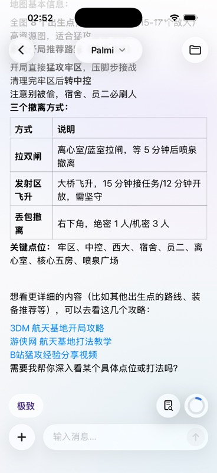
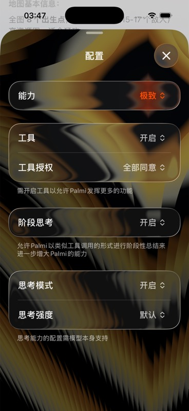

# PalmiAgent

PalmiAgent is a local-first iOS agent workspace for using OpenAI-compatible
models with project context, tools, skills, and a polished SwiftUI chat
experience.

  
  

## Highlights

- Chat and professional workspace modes for lightweight conversations or project-oriented work.
- OpenAI-compatible provider configuration for hosted APIs, local servers, and custom endpoints.
- Built-in provider profiles for OpenAI, Azure OpenAI, DeepSeek, Qwen, Kimi, MiniMax, Volcengine, Tencent Hunyuan, Baidu Qianfan, StepFun, ModelScope, SiliconFlow, OpenRouter, LM Studio, Ollama, and custom OpenAI-compatible APIs.
- Capability profiles for Speed, Quality, and Extreme modes, including a Metal-backed animated Extreme configuration effect.
- Tool runtime for workspace files, embedded Python execution, web research, attachments, and selected iOS system integrations.
- Project skills and context layers for steering model behavior without hardcoding every prompt into the chat UI.

## Requirements

- macOS with a recent Xcode toolchain that includes the iOS 26.1 SDK.
- Swift 5 project settings.
- An Apple development team configured in Xcode for device builds.
- API keys or local model servers supplied by the user at runtime.

## Getting Started

1. Open `PalmiAgent.xcodeproj` in Xcode.
2. Select the `PalmiAgent` scheme.
3. Choose an iOS simulator or a signed device.
4. Resolve Swift Package dependencies when Xcode prompts for them.
5. Build and run.

PalmiAgent does not bundle model weights. Configure model providers inside the
app before using hosted or local models.

## Repository Notes

The public repository intentionally excludes local agent instructions, reference
repositories, internal specs, and verification prompts. In particular,
`AGENTS.md`, `CLAUDE.md`, `docs/`, `TestPrompts/`, `reference/`, and local tool
state are ignored.

## License

PalmiAgent is licensed under the Apache License 2.0. You may use, modify,
distribute, and commercialize it, subject to the license terms.

Third-party components remain under their own licenses. See
`THIRD_PARTY_NOTICES.md`.

## Chinese README

简体中文说明见 `README.zh-CN.md`.
