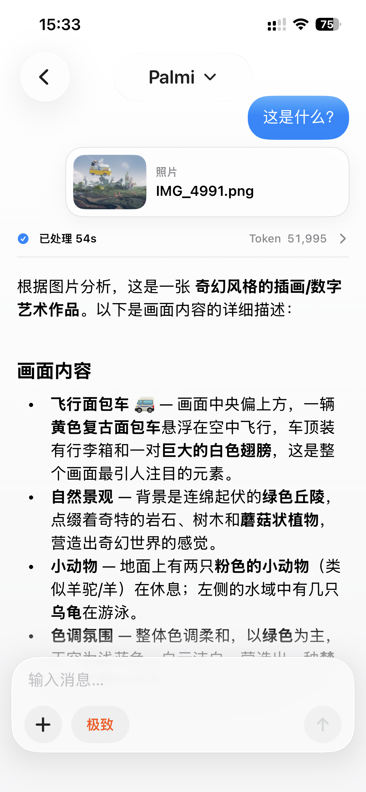

# PalmiAgent

PalmiAgent is a SwiftUI iOS workspace for model-driven work. It combines chat,
project files, model plans, multimodal input, local OCR, web research, Python
execution, and controlled system tools in one app.

  

## What It Does

- Runs conversations inside project and thread workspaces, so files, attachments,
  tool results, and chat history stay tied to the active task.
- Uses model plans with separate primary, multimodal, and lightweight model
  roles. Profiles can connect GLM/Z.AI, DeepSeek, local servers, or custom
  OpenAI-compatible endpoints.
- Supports multimodal work through inline image input, a dedicated multimodal
  scanning tool, and bundled PP-OCRv6 Tiny OCR assets for local text extraction.
- Streams model reasoning content while a task is running, then presents tool
  calls, progress notes, summaries, and final answers as structured chat cards.
- Provides workspace tools for reading, writing, appending, managing files,
  browsing directory trees, previewing generated files, and exporting folders.
- Includes an embedded CPython runtime with curated pure-Python packages for
  calculations, data handling, parsing, notebooks, and workspace automation.
- Adds web research tools for search-provider probing, search results, static
  page reading, batch fetches, and in-app browser previews.
- Can request controlled access to iOS capabilities such as Calendar,
  Reminders, Contacts, Location, Photos, Camera, Notifications, Speech,
  Spotlight, App Intents, Maps, Mail, Messages, Phone, FaceTime, Books,
  Podcasts, TV, and App Settings.

## Core Concepts

**Workspace**

Every task runs in a local workspace managed by PalmiAgent. Projects contain
threads, and each thread has its own file area for attachments, generated
artifacts, OCR output, Python logs, web captures, and chat state.

**Model Plan**

A model plan describes how the app should route work:

- Primary model for the main agent loop.
- Multimodal model for image understanding when the primary model is text-only.
- Lightweight model for smaller support tasks such as titles or compact work.

Model candidates can be validated without blocking configuration, and each
thread can temporarily override the active model plan.

**Tools**

Tools are grouped by risk and capability. Read-only actions, workspace writes,
personal-data access, system UI handoffs, and persistent changes are handled
with separate metadata and approval paths. The user can choose whether tool
authorization asks every time, allows all, or uses automatic review.

**Skills**

Skills are Markdown packages with optional metadata. They can be installed
globally or per project, toggled on and off, and injected into the agent prompt
for the active workspace.

## Multimodal Flow

When a message includes images, PalmiAgent chooses the best available route for
the current model setup:

1. Inline the image to the primary model when the primary model supports vision.
2. Use the configured multimodal model through the image scanning tool.
3. Fall back to local OCR when text extraction is the right path.

OCR results are written back to the workspace as `.ocr.txt` and `.ocr.json`
files, including recognized lines, confidence values, bounding boxes, and model
asset metadata.

## Interface

PalmiAgent has two main app surfaces:

- **Chat mode** for direct conversations and quick multimodal questions.
- **Professional workspace mode** for project navigation, thread management,
  file browsing, skill management, and long-running agent work.

The chat composer includes standard chat, goal mode, and deep research mode.
Goal and research modes are prompt-level task modes for a single turn; they do
not change the tool runtime, but they shape how the agent plans and reports the
work.

## Privacy And Safety

- API keys are supplied by the user at runtime and stored through the app's
  configuration layer.
- The repository does not include general-purpose LLM weights or provider
  services.
- Workspace files live in the app container unless exported by the user.
- Tool calls that touch personal data, open system UI, mutate workspace files,
  or create persistent system changes are represented separately in the runtime.
- App background transitions flush active chat state so interrupted sessions can
  recover more predictably.

## Requirements

- macOS with Xcode and the iOS 26.1 SDK.
- Swift 5 project settings.
- An Apple development team configured in Xcode for device builds.
- Runtime access to the model endpoints you want to use.

## Build

1. Open `PalmiAgent.xcodeproj` in Xcode.
2. Select the `PalmiAgent` scheme.
3. Choose an iOS simulator or a signed device.
4. Let Xcode resolve Swift Package dependencies.
5. Build and run.

The project uses MarkdownUI through Swift Package Manager, vendored
ZIPFoundation for archive handling, an embedded CPython runtime for Python
tools, and bundled PP-OCRv6 Tiny assets for OCR.

## Repository Map

- `PalmiAgent/Core/Agent` - agent loop, context assembly, tool routing,
  compaction, task state, reasoning, and multimodal routing.
- `PalmiAgent/Core/Configuration` - API profiles and model plan storage.
- `PalmiAgent/Core/LLM` - OpenAI-compatible model integration, capability
  metadata, reasoning controls, and runtime selection.
- `PalmiAgent/Core/Sandbox` - workspace storage, file operations, and Python
  execution.
- `PalmiAgent/Core/Skills` - skill package parsing, import, registry, and prompt
  composition.
- `PalmiAgent/Features/Chat` - chat UI, message state, attachments, tool cards,
  reasoning display, and context controls.
- `PalmiAgent/Features/Workspace` - project list, thread navigation, file
  browser, settings, model controls, and skill screens.
- `PalmiAgent/Integrations` - model calls, web research, OCR, media, personal
  data, system routing, and App Intents.
- `PalmiAgent/SharedUI` - reusable SwiftUI components, previews, attachment UI,
  selectable text, and visual effects.
- `Vendor/PythonSupport` - embedded Python runtime and curated Python packages.
- `PalmiAgent/Resources/OCR` - bundled PP-OCRv6 Tiny model resources and notices.

## License

PalmiAgent is licensed under Apache License 2.0.

Third-party components remain under their own licenses. See
`THIRD_PARTY_NOTICES.md`.

## Chinese

简体中文说明见 `README.zh-CN.md`.
