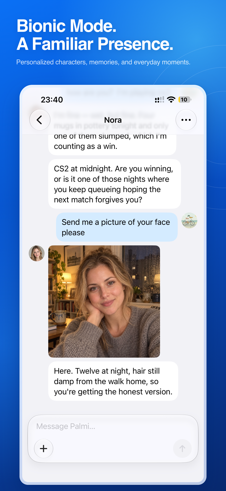
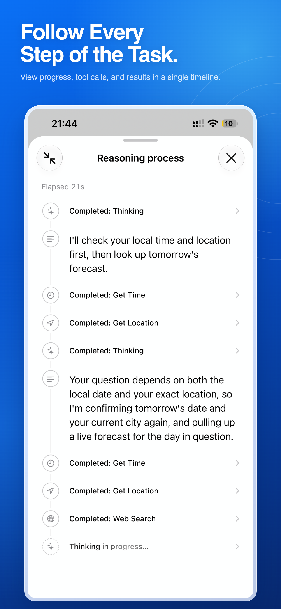
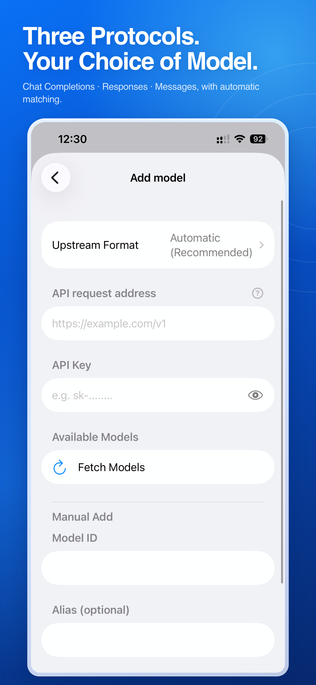
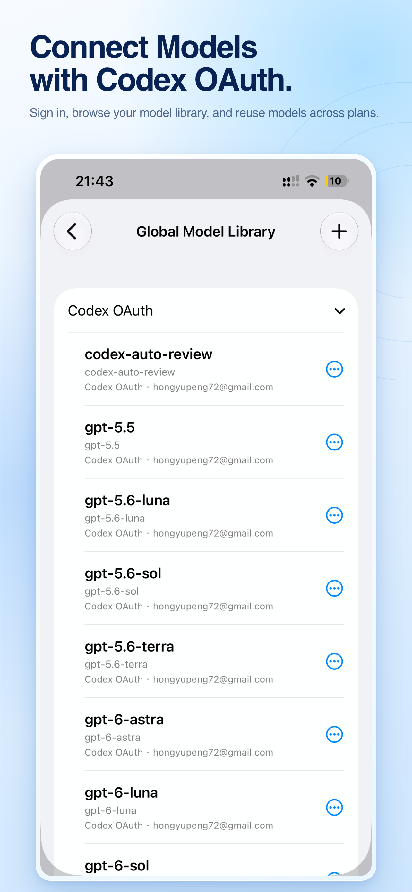
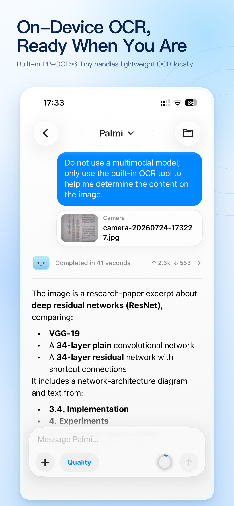
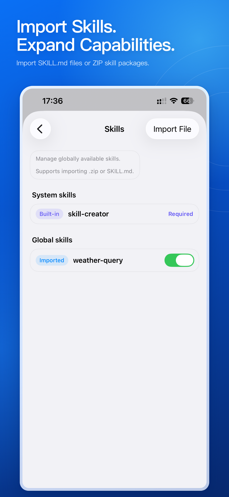

  <strong>English</strong> · <a href="README.zh-CN.md">简体中文</a>

<h1 align="center">
   
  Palmi
</h1>

  <a href="https://apps.apple.com/us/app/palmiagent/id6787664658"><strong>Download on the App Store</strong></a>

Palmi is a native AI application for iPhone and iPad. It combines everyday conversations, a project-based agent workspace, and conversations with virtual characters. Users connect their own model services and manage conversations, files, tools, and reusable workflows within the app.

The app stores its workspace on the device and sends model requests directly to the configured provider. It supports compatible cloud APIs, model services on a local network, and Codex OAuth accounts with the required access. The open-source repository retains the name **PalmiAgent**.

## Modes and conversations

Palmi provides three modes for different uses:

| Mode | Main functions |
| --- | --- |
| Chat | General questions, writing, image understanding, and tool-assisted conversations. |
| Professional | Projects, files, multi-step tasks, research, and generated deliverables. The agent can divide independent work among child agents and bring their results back into the main conversation. |
| Bionic | Conversations with virtual characters whose profiles, memories, fictional diaries, and proactive messages provide continuity across exchanges. |

Professional mode offers standard chat, Goal mode, and Deep Research mode. Runs show progress, tool calls, approvals, and results. Users can add messages while work is in progress and inspect the recorded process. Chat and Professional modes use Neo by default, with Hardcore available in runtime settings. The selected display style is saved. Neo presents the task process as a timeline with expandable steps and elapsed time.

Bionic characters can be created manually, imported from an archive, or created with the built-in character-creation skill in Professional mode. Character settings include a name, avatar, background, personality, and model configuration. Conversations support history search, immediate or natural reply timing, pinned chats, muted notifications, custom backgrounds, and archive export and import. Generated characters, stories, and images are fictional.

Bionic Basic includes the built-in Palmi character and up to two custom characters. Characters form memories and generate diaries on the free plan. A one-time Bionic Pro purchase increases the custom-character limit to 99 and adds memory detail viewing, navigation to source messages, manual memory editing, diary reading, and the developer inspection panel. Model usage is separate from this purchase.

  
  

## Model connections

Users can add a service address, API key, and model ID, select OpenAI Chat Completions, OpenAI Responses, or Anthropic Messages, or use automatic protocol matching. Built-in provider presets cover services such as OpenAI, Azure OpenAI, DeepSeek, GLM / Z.AI, Qwen, Kimi, MiniMax, OpenRouter, SiliconFlow, Ollama, and LM Studio. Other compatible services can be added manually.

The global model library supports remote model discovery, manual entries, and connection validation. Model plans assign primary, multimodal, and lightweight roles; saved plans can be reused and selected per conversation. Supported models expose controls for thinking modes and reasoning effort. Response styles can be selected or described with a custom instruction.

Codex OAuth sign-in imports account-associated models into the library. Image Generation Settings selects an available image model for supported image-generation tools and Bionic interactions. Model availability, image access, usage limits, and charges depend on the connected account or provider.

  
  

## Workspace and tools

Professional mode organizes work into projects and conversations. Attachments, source material, intermediate files, and deliverables stay in the relevant workspace. Users can browse and preview files, open generated HTML tools and visualizations, and export projects. The agent can read, create, append, move, copy, rename, and organize workspace files. Document tools extract text and assets from PDF, Office and iWork documents, and supported archives.

Web research supports local search with Baidu, Bing, DuckDuckGo, Sogou, or 360 Search, and separately configured remote search services using Responses or Messages. The agent can read web pages and PDFs, follow links, retrieve sources in batches, and use selected ranges from long documents. Supporting sources and tool results remain available in the conversation.

Local computation tools support calculations and data processing on the device. They can read task inputs and write result files inside the workspace.

Images can be interpreted by a vision-capable primary model or a separate multimodal model. Bundled PP-OCRv6 Tiny resources provide on-device text recognition, including line content, confidence values, and bounding boxes. The app also supports native document and live text scanning.

Skills supply reusable instructions for specific workflows. Users can import a `SKILL.md` file or a ZIP package, make it available globally or within a project, and manage it from the app. The built-in Skill Creator helps produce additional skills. Device integrations include Calendar, Reminders, Contacts, location and Maps, Camera, Photos, notifications, and speech input and output, subject to system permissions and the selected tools.

Conversation and task state persist locally. Long tasks can condense earlier context while preserving task state. Background processing can continue for the time allowed by iOS; it does not guarantee uninterrupted execution while the app is closed.

  
  

## Data and permissions

Conversations, project files, character archives, task state, and settings are stored on the device by default. API keys and Codex OAuth credentials use the system Keychain. Palmi does not operate a server that relays model conversations. Requests send the content needed for the task directly to the model or search service selected by the user; those services apply their own terms and privacy policies.

Tool authorization can ask for approval each time, allow enabled tools, or apply automatic review with a user-defined policy. Tool activity, approvals, and file changes are recorded in the task process. Access to protected device data also follows iOS permissions. Local file operations, Python execution, and OCR can run on the device.

## Installation and source

Download [Palmi from the App Store](https://apps.apple.com/us/app/palmiagent/id6787664658), configure a compatible model service or an eligible Codex OAuth account, and select a model plan. The app requires **iOS or iPadOS 26.1 or later**. Its interface is available in Simplified Chinese, Traditional Chinese, English, Japanese, and Korean.

Palmi does not include general-purpose model weights or third-party model credits. Network features require connectivity and provider availability. Bionic Basic and Bionic Pro both use the model services configured by the user and do not include model-service credits.

The source is released under the [Apache License 2.0](LICENSE).

- [Source repository](https://github.com/Hyp6666/PalmiAgent)
- [Issues and feature requests](https://github.com/Hyp6666/PalmiAgent/issues)
- [Releases](https://github.com/Hyp6666/PalmiAgent/releases)
- [Third-party components and licenses](THIRD_PARTY_NOTICES.md)
