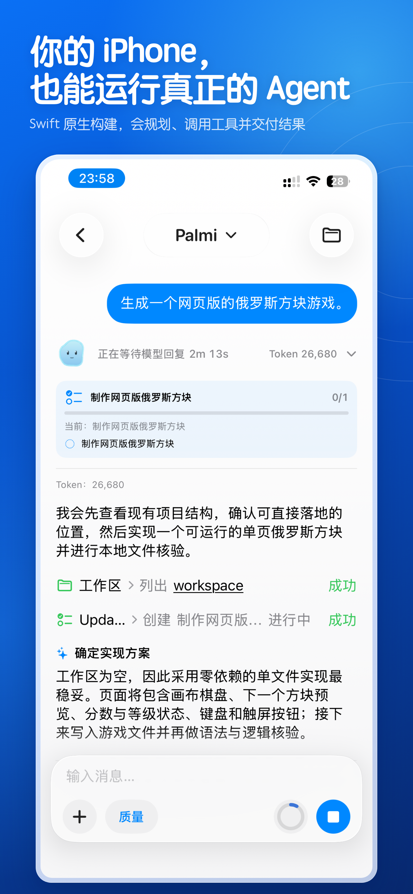
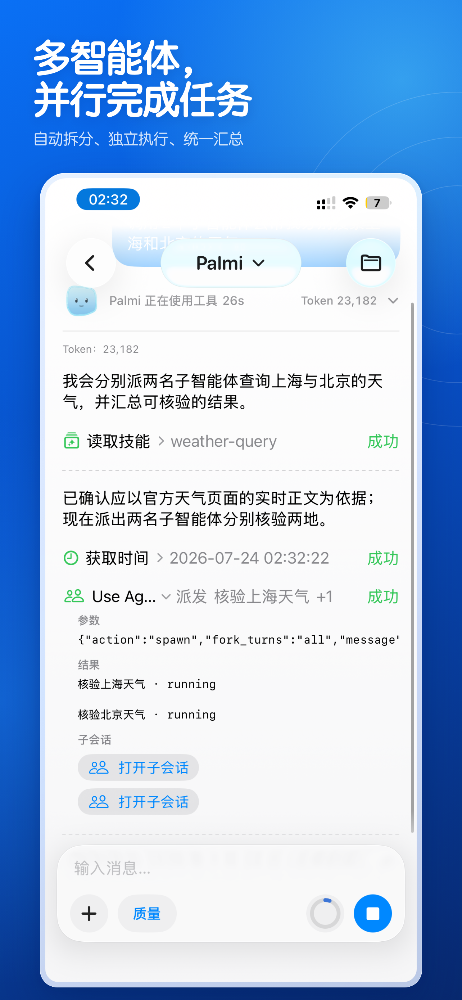
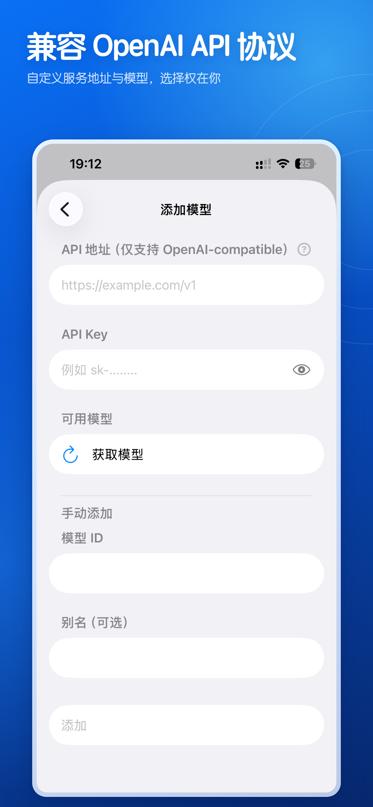
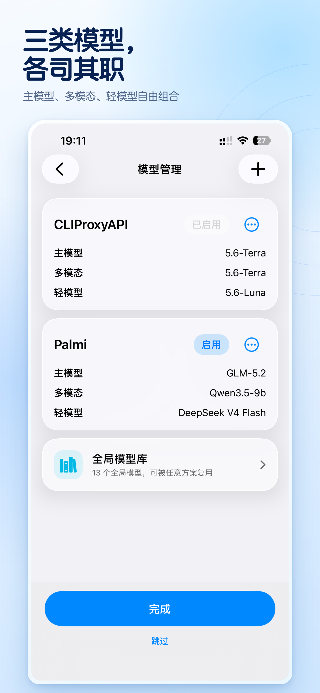
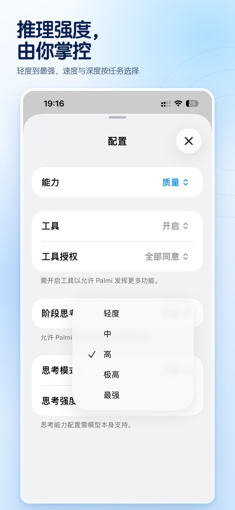
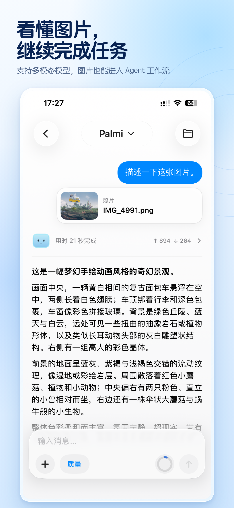
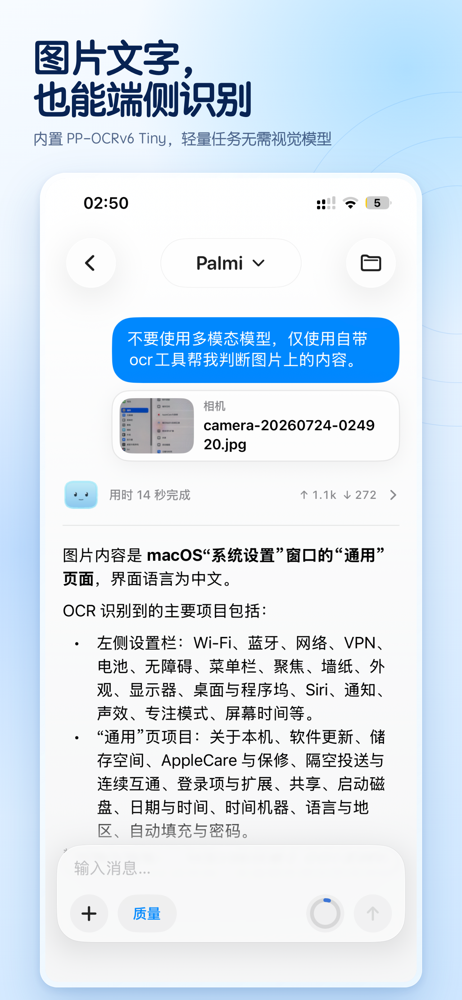
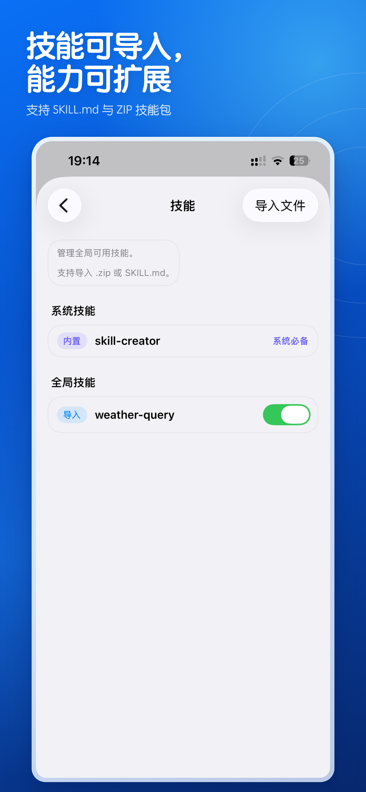

  <a href="README.md">English</a> · <strong>简体中文</strong>

<h1 align="center">
   
  PalmiAgent
</h1>

  <a href="https://apps.apple.com/cn/app/palmiagent/id6787664658"><strong> 在 App Store 免费下载</strong></a>

  <strong>让 AI 在 iPhone 上真正开始做事。</strong> 
  本机优先、模型自由、工具可控的个人 AI Agent 工作区。

PalmiAgent 不只回答问题。它能围绕一个真实任务持续工作：理解目标、阅读文件、搜索资料、调用工具、运行 Python、整理产物，并把对话、过程和结果完整留在你的工作区里。

你选择模型，PalmiAgent 负责把模型变成一位真正能行动的移动 Agent。

  

## 不止聊天，而是完成任务

普通 AI 聊天在回复结束时停止，PalmiAgent 则为持续执行而设计。

- **完整 Agent 循环**：围绕目标分析、规划、调用工具、读取结果并继续推进，直到形成最终答复或可交付文件。
- **对话内的三种任务方式**：日常问题使用标准聊天；复杂目标交给目标模式；需要多来源查证时使用深度研究模式。
- **长任务不断档**：自动压缩较早上下文并保护关键任务状态；开启后台处理后，离开 App 或锁屏时可在 iOS 允许的时间内继续运行。
- **运行中也能追加想法**：Agent 工作时可以先把新消息放入待发送队列，在下一个安全节点继续处理。
- **过程清晰可见**：阶段思考、工具调用、审批、任务状态、引用依据、文件变更、耗时与 Token 使用都有结构化记录。

### 多个 Agent，并行推进

复杂任务可以拆分给多个独立的子 Agent，主 Agent 负责协调工作、收集结果并继续决策。

  

### 一条提示词，到可交互的成果

PalmiAgent 可以创建独立运行的 HTML 工具、可视化作品和网页游戏，并直接在应用内打开和使用。

  

## 你的模型，由你决定

PalmiAgent 不把你绑定在某一家模型服务上，也不通过自有云端代理你的模型请求。

### 接入你自己的模型服务

直接连接你自己的 API 账号、局域网模型服务或 OpenAI-compatible endpoint。内置支持 OpenAI、Azure OpenAI、GLM / Z.AI、DeepSeek、Qwen、Kimi、MiniMax、豆包、混元、千帆、阶跃星辰、ModelScope、SiliconFlow、OpenRouter、Ollama 与 LM Studio，也可手动添加其他兼容服务。

  

### 三种模型角色，一套灵活方案

为**主模型、多模态模型和轻量模型**分别安排角色，在能力、速度与成本之间自由组合。模型保存在全局模型库中，可以被不同方案和会话重复使用。

  

### 每次对话，都能选择合适的思考深度

支持远程模型列表发现、手动填写模型 ID、连接验证、会话级临时切换，以及不同模型的思考开关与强度控制。API Key 保存在系统 Keychain 中。

  

无论你偏爱云端旗舰模型、性价比模型，还是家中局域网内运行的本地模型，都可以保留自己的选择权。

## 每个任务，都有自己的工作区

PalmiAgent 把聊天从一串容易丢失的消息，变成可持续维护的项目。

- **两种界面形态**：它们与上面的任务方式不是同一层级；**聊天模式**保留轻量直接的使用体验，**专业模式**则提供项目、会话、文件和长任务管理。
- 用项目和会话组织不同主题，聊天记录、附件、网页资料、OCR 结果、Python 日志和生成文件始终归属于当前任务。
- Agent 可以读取、创建、追加、移动、复制、重命名和整理工作区文件。
- 在 App 内浏览目录、预览附件和生成物，完成后直接导出整个项目。
- 可拆解 PDF、Word、Excel、PowerPoint、Pages、Numbers、Keynote、RAR 与 7z 等复杂文件，按需读取其中的文本和原始资源。
- 会话与任务状态持续保存在本机，应用中断后仍能识别未完成运行，避免不安全的重复执行。

今天收集的资料、明天追加的数据、下周继续的报告，都可以在同一个上下文里自然衔接。

## 把真正的 Python 装进 iPhone

PalmiAgent 内置真实的 **CPython 3.14** 运行环境，让 Agent 不必只靠语言模型“心算”。

- 执行计算、符号推导、日期处理、文本与结构化数据处理。
- 读取和生成 Excel，整理 JSON、CSV、HTML、XML 与表格。
- 使用 SymPy、openpyxl、NetworkX、Beautiful Soup、tabulate 等精选纯 Python 包。
- 脚本在受限的本机工作区内执行，可直接读取任务输入并写回结果文件。

从一组数据到一份表格，从一个公式到可复核的计算过程，结果不再只是“听起来合理”。

## 看懂图片，也读出文字

你可以从相机、照片或文件中加入图片，PalmiAgent 会根据当前配置选择合适的处理方式。

- 主模型支持视觉时，直接进行图片理解。
- 主模型不看图时，可交给单独配置的多模态模型。

  

- 需要提取文字时，使用内置 PP-OCRv6 Tiny 在设备端完成 OCR。
- OCR 不只返回纯文本，还可保存行级内容、置信度和位置框等结构化结果，方便后续检索和处理。
- 工具中心同时接入文档扫描与实时文本扫描能力。

  

一张截图、一页资料、一份拍照文档，都可以直接成为任务上下文。

## 从搜索结果走到可验证结论

PalmiAgent 的网页能力面向研究流程，而不只是打开一个搜索框。

- 支持多个搜索源，并可先检测当前网络环境下哪些来源可用。
- 搜索候选页面后，继续读取网页、JavaScript 页面、PDF、JSON、XML 与纯文本内容。
- 可批量获取多个来源，按区间读取长页面，减少无关上下文与 Token 消耗。
- 必要时可归档网页及其图片、样式、脚本和字体，保留可追溯的研究素材。
- 链接可在 Palmi 内置浏览器或 Safari 中继续查看。

配合深度研究模式，Agent 可以自己检索、阅读、比较和整理，而你始终能看到它使用了哪些依据。

## 用 Skills 教会 Palmi 新方法

不同工作需要不同流程。PalmiAgent 的 Skills 让 Agent 可以按需加载专门的任务说明，而不必把所有规则永久塞进每次对话。

- 从 `SKILL.md` 或 ZIP 导入技能包。
- 技能可以全局使用，也可以只属于某个项目。
- 随时启用、停用、查看或删除已导入技能。
- 内置 Skill Creator，帮助你直接在移动工作区中创建自己的技能。
- 技能按需读取，既减少无关上下文，也让复杂流程更容易复用。

  

你可以为调研、写作、数据分析、代码审查或自己的行业流程制作专属技能，让 Palmi 越来越贴合你的工作方式。

## 与 iPhone 的能力真正连接

PalmiAgent 是原生 SwiftUI 应用，不是套在网页外面的聊天窗口。

工具中心已经接入日历、提醒事项、通讯录、系统闹钟与倒计时、定位、附近地点、Apple 地图、相机、照片、通知、语音识别与朗读、邮件、短信、电话、FaceTime、Spotlight、App Intents、Handoff 等系统能力。

不同能力会根据风险与系统要求单独请求权限。涉及用户继续操作的动作会交回系统界面完成，不会在后台静默越权。

PalmiAgent 同时提供简体中文、繁体中文、English、日本語和한국어界面。你还可以选择专注或亲切的回复风格，也可以写下自己的自定义人格，让 Palmi 用更适合你的方式沟通。

## 隐私不是一句口号，而是产品架构

- **本机保存**：会话、工作区文件、任务状态和设置默认保存在设备上。
- **没有自有模型中转服务器**：模型请求从设备直接发送到你选择并配置的第三方接口。
- **敏感信息进 Keychain**：API Key 由系统 Keychain 保存。
- **只处理你主动加入的内容**：未加入当前任务的照片、文件或个人数据不会因为打开 App 而自动上传。
- **工具权限由你掌控**：可以选择每次询问、全部同意或按照自定义策略自动审查；单次会话也能单独授权。
- **副作用可追踪**：文件变更、工具动作与审批过程都会进入任务过程记录。
- **本地能力优先**：文件管理、Python 执行与 OCR 等能力可以直接在设备端完成。

当你调用第三方模型或搜索服务时，完成请求所需的内容仍会发送给相应服务商，并受其条款与隐私政策约束。PalmiAgent 会清楚说明这个边界，把最终选择留给你。

## 适合这些工作

- **研究与学习**：搜索多方资料、阅读长文档、提取重点并整理带依据的结论。
- **数据与办公**：处理表格、执行计算、生成报告，让结果以文件形式留在工作区。
- **图片与文档处理**：理解截图、扫描纸质材料、识别文字并继续分类或总结。
- **开发与技术工作**：阅读项目文件、生成代码和说明文档、调用 Python 验证结果。
- **长期个人项目**：把多轮对话、素材、决定和产物放进同一个可继续的项目中。
- **模型玩家**：组合云端、本地、多模态与轻量模型，精细控制思考方式和工具权限。

## 三步开始

1. [从 App Store 下载 PalmiAgent](https://apps.apple.com/cn/app/palmiagent/id6787664658)。
2. 添加你自己的模型服务、API Key 或局域网模型地址，并选择主模型。
3. 新建对话或项目，加入文件、图片或一个目标，让 Palmi 开始工作。

> **系统要求：** iOS 26.1 或更高版本。PalmiAgent 不内置通用大模型权重，也不赠送第三方模型额度。使用前需要自行准备可用的模型服务；联网搜索、云端模型及部分系统能力还需要网络、服务可用性或相应的 iOS 权限。后台任务的持续时间由 iOS 决定。

## 开源

PalmiAgent 使用 SwiftUI 构建，并以 [Apache License 2.0](LICENSE) 开源。你可以查看实现、提交问题、改进功能，或基于项目探索属于自己的移动 Agent。

- [查看源代码](https://github.com/Hyp6666/PalmiAgent)
- [提交问题或建议](https://github.com/Hyp6666/PalmiAgent/issues)
- [第三方组件与许可](THIRD_PARTY_NOTICES.md)

  <strong>把模型装进工作流，把 Agent 带在身边。</strong>  
  <a href="https://apps.apple.com/cn/app/palmiagent/id6787664658"><strong> 在 App Store 免费下载 PalmiAgent</strong></a>

