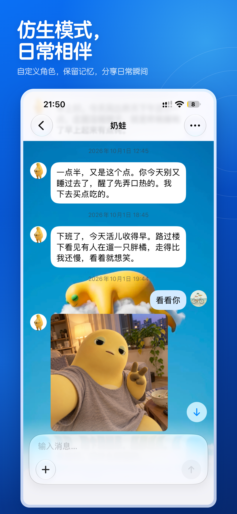
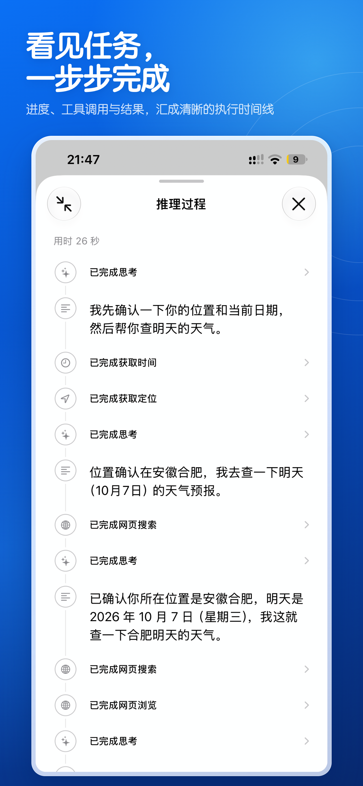
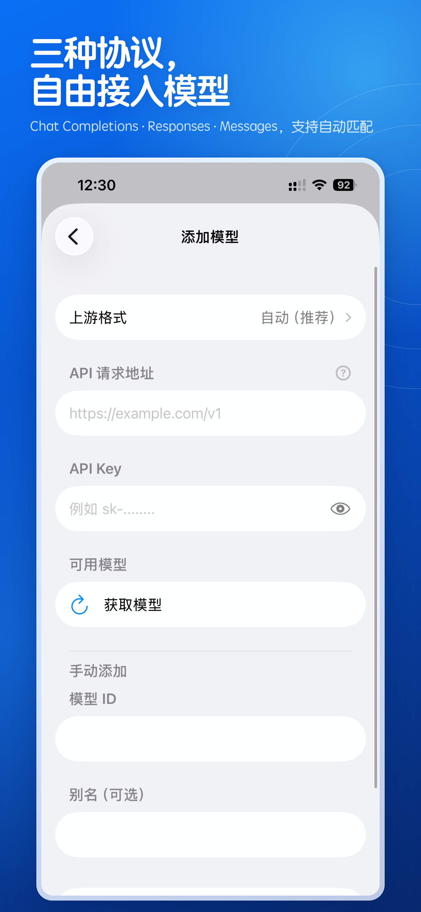
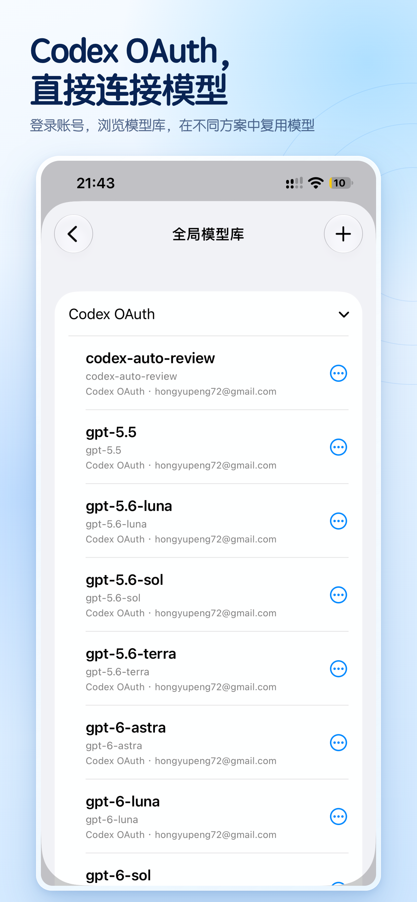
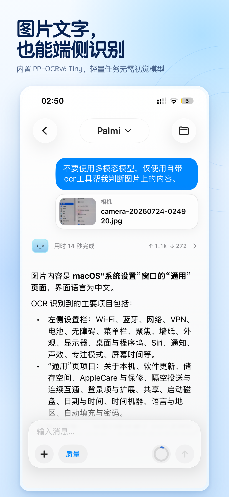
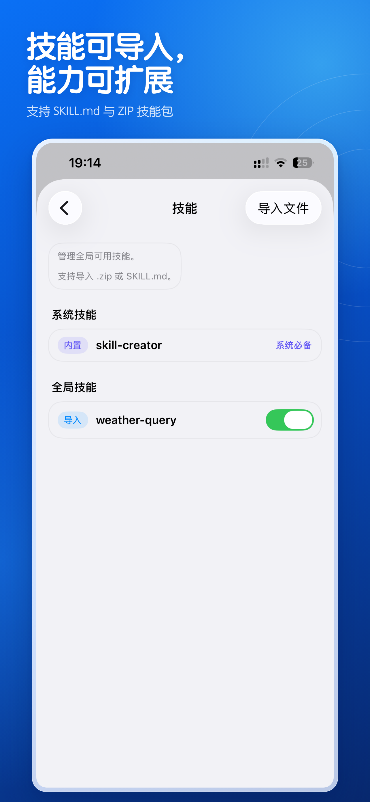

  <a href="README.md">English</a> · <strong>简体中文</strong>

<h1 align="center">
   
  Palmi
</h1>

  <a href="https://apps.apple.com/cn/app/palmiagent/id6787664658"><strong>在 App Store 下载</strong></a>

Palmi 是面向 iPhone 和 iPad 的原生 AI 应用，提供日常对话、以项目组织的智能体工作区，以及虚拟角色对话。用户自行接入模型服务，在应用内管理对话、文件、工具和可复用的工作流程。

应用将工作区保存在设备上，模型请求直接发送到用户配置的服务。支持兼容的云端 API、局域网模型服务，以及具备相应访问权限的 Codex OAuth 账号。开源仓库名称仍为 **PalmiAgent**。

## 使用模式与对话

Palmi 提供三种使用模式：

| 模式 | 主要功能 |
| --- | --- |
| 聊天 | 日常问答、写作、图像理解和工具辅助对话。 |
| 专业 | 项目、文件、多步骤任务、资料研究和成果文件。智能体可以把独立工作分配给子智能体，再将结果汇入主对话。 |
| 仿生 | 与虚拟角色对话，通过角色设定、记忆、虚构日记和主动消息延续交流。 |

专业模式中的对话可选择标准聊天、目标模式或深度研究模式。运行过程展示进度、工具调用、审批和结果，用户可以在执行期间追加消息，并查看已记录的过程。聊天与专业模式默认使用 Neo 显示风格，也可在运行体验设置中切换至 Hardcore，所选风格会保存。Neo 将任务过程呈现为时间线，支持展开步骤详情并显示耗时。

仿生角色可以手动创建、从存档导入，也可以使用专业模式内置的角色创建技能生成。角色设置包含名称、头像、背景、性格和模型配置。对话支持历史搜索、秒回或自然回复节奏、置顶、免打扰、自定义聊天背景，以及存档导出与导入。角色、故事和生成图片均为虚构内容。

仿生基础版包含内置 Palmi 角色，并可保留最多两个自定义角色。免费方案中的角色也会形成记忆、生成日记。一次性购买仿生 Pro 后，自定义角色上限提升至 99 个，并解锁记忆详情、来源消息跳转、手动记忆编辑、日记阅读和开发者检查面板。模型服务的使用费用与此项购买分开计算。

  
  

## 模型接入

用户可以填写服务地址、API Key 和模型 ID，选择 OpenAI Chat Completions、OpenAI Responses 或 Anthropic Messages，也可以使用自动协议匹配。内置服务配置涵盖 OpenAI、Azure OpenAI、DeepSeek、GLM / Z.AI、Qwen、Kimi、MiniMax、OpenRouter、SiliconFlow、Ollama 和 LM Studio 等；其他兼容服务可手动添加。

全局模型库支持获取远程模型列表、手动添加模型和连接验证。模型方案可分别配置主模型、多模态模型和轻量模型，保存后在不同对话中复用。支持相应能力的模型可以调整思考开关与推理强度。用户也可以选择表达风格，或填写自定义表达要求。

Codex OAuth 登录可将账号关联的模型导入模型库。图像生成设置用于选择可用的图像模型，供支持的图像工具和仿生交互使用。模型可用性、图像访问权限、额度和费用取决于所连接的账号或服务商。

  
  

## 工作区与工具

专业模式通过项目和会话组织工作，附件、原始资料、中间文件和成果保存在对应工作区中。用户可以浏览与预览文件，打开生成的 HTML 工具和可视化内容，并导出项目。智能体能够读取、创建、追加、移动、复制、重命名和整理工作区文件。文档工具可从 PDF、Office、iWork 文档及支持的压缩包中提取文本与资源。

网页研究支持本地搜索和单独配置的远程搜索。本地搜索可选择百度、Bing、DuckDuckGo、搜狗或 360 搜索；远程搜索通过 Responses 或 Messages 服务提供。智能体可以读取网页和 PDF、跟进链接、批量获取来源，并按范围读取长文档。引用来源和工具结果保留在对话中供查看。

本地计算工具可在设备上执行计算和数据处理，读取任务输入，并将结果文件写入工作区。

图片可以交给支持视觉的主模型，或单独配置的多模态模型理解。内置 PP-OCRv6 Tiny 资源提供端侧文字识别，可输出文字行、置信度和边界框。应用也支持系统文档扫描与实时文字扫描。

技能为特定工作提供可复用的操作说明。用户可以导入 `SKILL.md` 文件或 ZIP 技能包，将技能设为全局可用或仅在项目内使用，并在应用中管理。内置 Skill Creator 可辅助创建技能。设备集成包括日历、提醒事项、通讯录、定位与地图、相机、照片、通知及语音输入与朗读，使用时遵循系统权限和工具设置。

对话与任务状态保存在本地。长任务可以压缩较早的上下文并保留任务状态。后台处理可在 iOS 允许的时间内继续运行，实际运行时长由系统管理。

  
  

## 数据与权限

对话、项目文件、角色存档、任务状态和设置默认保存在设备上。API Key 和 Codex OAuth 凭据使用系统 Keychain 保存。Palmi 不运行中转模型对话的服务器；请求所需的任务内容会直接发送到用户选择的模型或搜索服务，并适用相应服务商的条款和隐私政策。

工具授权支持每次询问、允许已启用工具，以及依据用户策略进行自动审核。工具活动、审批和文件变更会记录在任务过程中。访问受保护的设备数据还需遵循 iOS 权限。文件操作、Python 执行和 OCR 可以在设备上完成。

## 安装与开源

从 [App Store 下载 Palmi](https://apps.apple.com/cn/app/palmiagent/id6787664658)，配置兼容的模型服务或具备访问权限的 Codex OAuth 账号，然后选择模型方案。应用要求 **iOS 或 iPadOS 26.1 及以上版本**，界面提供简体中文、繁体中文、英语、日语和韩语。

Palmi 不附带通用模型权重或第三方模型额度。联网功能需要网络连接和相应服务可用。仿生基础版和仿生 Pro 均使用用户配置的模型服务，不包含模型服务额度。

项目采用 [Apache License 2.0](LICENSE) 开源。

- [源代码仓库](https://github.com/Hyp6666/PalmiAgent)
- [问题反馈与功能建议](https://github.com/Hyp6666/PalmiAgent/issues)
- [版本发布记录](https://github.com/Hyp6666/PalmiAgent/releases)
- [第三方组件与许可证](THIRD_PARTY_NOTICES.md)
