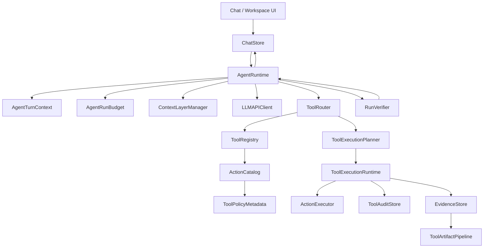
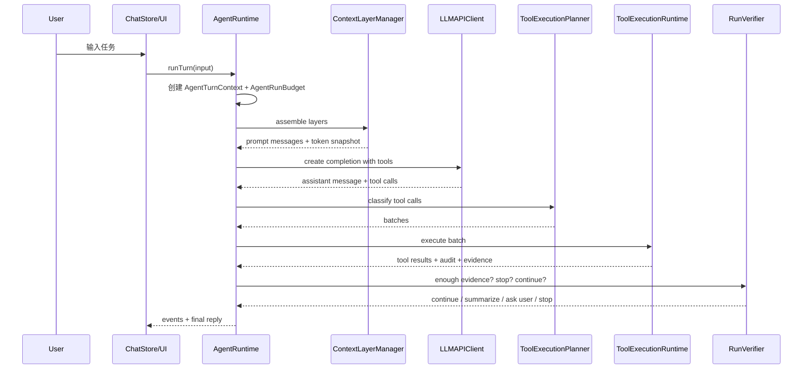

# PalmiAgent Codex-style Agent Runtime 重构 Spec

> 日期：2026-05-19
> 状态：设计锁定，待分阶段实现
> 本轮目标：把 PalmiAgent 的 Agent 框架从“单个巨大 AgentLoop”重构成 Codex-style 的单 Agent runtime。
> 关键约束：不引入复杂 multi-agent；不改成 Rust；不把 iOS app 塞进外部服务；先重构运行时边界，再做 UI/权限/并发。

---

## 1. 一句话目标

PalmiAgent 要从“聊天里顺序调用工具”升级成“iOS 上可预算、可中断、可审计、可解释的执行型 Agent runtime”。

这次不是把现有 loop 推倒重写成多个 agent，而是保留单 AgentLoop 的移动端可控性，把内部拆成 Codex-style 的几个硬边界：

```text
TurnContext -> ContextLayers -> ModelRequest -> ToolRouter -> ToolExecutionRuntime -> Audit/Evidence -> Verifier -> FinalReply
```

---

## 2. 已读参考

### 2.1 本地 Codex 参考源码

重点阅读路径：

| Codex 文件 | 借鉴点 |
|---|---|
| `reference/codex-main/codex-rs/core/src/session/turn_context.rs` | 一次 turn 的模型、权限、sandbox、tools、skills、环境、截断策略集中在 `TurnContext` |
| `reference/codex-main/codex-rs/core/src/session/turn.rs` | turn loop 以“采样请求 -> 处理 response event -> 工具 future -> follow-up”为核心 |
| `reference/codex-main/codex-rs/core/src/tools/registry.rs` | 工具注册表把 model-visible spec 和本地 runtime 分离 |
| `reference/codex-main/codex-rs/core/src/tools/router.rs` | ToolRouter 负责把模型输出转成 typed tool call 并分发 |
| `reference/codex-main/codex-rs/core/src/tools/parallel.rs` | 支持并发工具，但用读写锁让不支持并发的工具串行化 |
| `reference/codex-main/codex-rs/core/src/exec_policy.rs` | 执行策略和审批策略不靠 prompt，走硬规则 |
| `reference/codex-main/codex-rs/core/src/safety.rs` | patch/write 这类副作用动作先做安全判断 |
| `reference/codex-main/codex-rs/core/src/turn_timing.rs` | TTFT/TTFM/turn duration 是 runtime 一等指标 |

### 2.2 当前 Palmi 关键路径

重点阅读路径：

| Palmi 文件 | 当前状态 |
|---|---|
| `PalmiAgent/Core/Agent/AgentLoop.swift` | 已有完整单 loop、queued guidance、context compaction、hidden artifacts、final reply guard；但职责过重 |
| `PalmiAgent/Core/Agent/AgentModels.swift` | 有 session/message/event，但缺 run budget、audit、evidence、tool batch event |
| `PalmiAgent/Core/Agent/AgentToolExecutor.swift` | 工具准备和执行集中在这里；停止条件只依赖 `presentationKind` |
| `PalmiAgent/Core/Actions/ToolAction.swift` | 只有 presentation kind，没有风险、并发、副作用、确认策略 |
| `PalmiAgent/Core/Agent/ReasoningStrengthProfile.swift` | 同时控制模型 reasoning、iteration、web 字符数、context compaction，语义混杂 |
| `PalmiAgent/Core/Agent/ContextAssembler.swift` | system prompt、hidden summary、hidden research、raw messages 已能组装，但还不是分层策略 |
| `PalmiAgent/Core/Agent/ToolArtifactPipeline.swift` | 已有隐藏 research artifacts，但 UI 和 final evidence 没接上 |
| `PalmiAgent/Features/Chat/ChatStore.swift` | 已能消费 tool/thought/compaction event，但还没有 budget/progress/evidence/approval 事件 |

### 2.3 CCSwitch 参考边界

CCSwitch 主要用于 LLM provider 接入层，不是 Agent runtime 主参考。本 spec 只借鉴两个理念：

1. “能力差异必须数据化”，不要散落在 if/else 和文案里。
2. “adapter/policy 是硬边界”，不要只靠 prompt 暗示模型怎么做。

---

## 3. 当前核心问题

### 3.1 AgentLoop 过重

现在 `AgentLoop.runTurn()` 同时做这些事：

1. 追加用户消息。
2. 组装工具定义。
3. 组装 prompt/context。
4. 调模型。
5. 解析 assistant/tool calls。
6. 顺序执行工具。
7. 写入 tool result。
8. 生成 hidden artifact。
9. 处理 phase thought。
10. 做 context compaction。
11. 判断 stop after step。
12. 做 final summary streaming。

这会让任何一个新需求都继续堆进同一个函数：并发、权限、预算、证据、长任务恢复、provider capability 都会互相污染。

### 3.2 工具缺元数据

`ToolActionID.presentationKind` 只能区分：

```text
data / action / interactive
```

但 Agent runtime 真正需要的是：

```text
risk level
side effect
parallel policy
confirmation policy
personal data access
workspace mutation
system interaction
idempotence
cacheability
```

没有这些元数据，就无法做安全并发、长任务预算、确认卡、审计日志和停止条件。

### 3.3 “强度”语义混杂

`ReasoningStrengthProfile` 现在同时控制：

1. 模型原生 reasoning effort。
2. Agent 最大 iteration。
3. web search result count。
4. fetch 字符数。
5. context compaction target。

这会造成两个问题：

1. 用户以为自己调的是“模型思考强度”，实际也在改 Agent 行为预算。
2. `.infinite` 的 1000 iterations 对移动端不可控。

当前代码里已经有 `LLMProviderRuntimeProfile`、`LLMNativeReasoningEncoding`、`LLMModelCapabilities` 和若干 OpenAI-compatible 请求字段，但它仍然被 `ReasoningStrengthProfile.modelReasoningEffort` 驱动。也就是说，底层字段已经开始拆，但上层控制语义还没有拆干净。

最终目标是彻底删除“一个质量档位同时控制模型 thinking、Agent loop、搜索条数、网页字符数、压缩策略”的模式。

### 3.3.1 官方文档核查结论：不能用一个硬编码强度参数打天下

| 厂商/模型 | 是否有原生强度参数 | 实际参数形态 | Palmi 设计结论 |
|---|---|---|---|
| OpenAI / Codex | 有 | Responses API 使用 `reasoning.effort`；官方列出 `none/minimal/low/medium/high/xhigh`，实际支持值按模型变化 | 可以映射 Palmi 的 thinking intent，但必须按模型 capability 裁剪；不能默认所有 OpenAI-compatible 都支持 |
| DeepSeek | 有，但不是完整 low/medium/high/xhigh | `thinking.type=enabled/disabled` + `reasoning_effort=high/max`；官方说明 low/medium 映射 high，xhigh 映射 max | Palmi 只能映射为 off/high/max 三态；thinking 开启时不应再认为 temperature/top_p 有意义 |
| GLM / Z.AI | 有 thinking 开关，没有官方 low/medium/high 档 | `thinking.type=enabled/disabled`；agent/coding 场景可用 `clear_thinking:false` 保留思考链 | Palmi 只能映射为 off/on；是否 preserved thinking 是 replay policy，不是强度档位 |
| Qwen / 阿里百炼 | 有，且最像预算旋钮 | `enable_thinking` + `thinking_budget`；thinking-capable models from Qwen3 onward support budget | Palmi 可把 intent 映射成 token budget，但预算值必须来自 model metadata/default，不应散落硬编码 |
| Kimi / Moonshot | 主要是模型/开关，不是 effort 档位 | `kimi-k2-thinking` 强制 thinking；`kimi-k2.5` 默认 thinking；返回 `reasoning_content`；工具多轮要回传 | Palmi 不能映射 low/high；只控制是否启用、是否回传、是否固定 temperature=1 |
| MiniMax | 没看到官方 `reasoning_effort` | `reasoning_split=true` 把 thinking 拆到 `reasoning_details`；否则可能在 `<think>` 内 | Palmi 只做 split/replay，不做 low/high |
| LM Studio | 没有统一标准 | OpenAI-compatible chat 支持常规采样参数；tool use 取决于模型 chat template 与 LM Studio parser | Palmi 默认不发送 reasoning 控制；只根据本地模型 metadata/用户高级配置显式启用 |

### 3.3.2 已知必须根治的问题：DeepSeek thinking tool replay 400

已复现用户侧报错：

```text
请求定位并反查成功；
补充后续模型请求失败，已停止自动续跑；
DeepSeek 调用失败：HTTP 400；
The reasoning content in the thinking mode must be passed back to the API
```

判断：这不是定位工具错误，而是 DeepSeek thinking 模式下多轮工具调用的消息历史回放错误。

根因方向：

1. DeepSeek thinking 响应会返回 `reasoning_content`。
2. 如果 assistant 消息里包含 tool calls，下一轮把 tool result 发回模型时，必须把对应 assistant message 的 `reasoning_content` 一并回传。
3. 当前 Palmi 已有 `supportsReasoningReplay` 和 `AgentNativeReasoningPayload`，但 DeepSeek 的续跑链路仍可能在某处丢失或投影时移除了 native reasoning。
4. 一旦丢失，DeepSeek 服务端直接拒绝后续请求，返回 400。

后续实现要求：

1. 对 DeepSeek/Kimi/MiniMax/Qwen 这类声明需要 reasoning replay 的模型，assistant tool-call 历史必须保留并回传 native reasoning payload。
2. `OpenAICompatibleChatAdapter.preparedMessages` 只能在 provider/model 不需要 replay 时移除 native reasoning；不能按 provider 粗暴移除。
3. `ContextAssembler.convert()`、`LLMAPIClient.convertToAPIMessages()`、`AgentSession` 持久化和 compaction 之后，都必须保证当前 turn 的 assistant tool-call message 不丢 `reasoning_content` / `reasoning_details`。
4. 如果 compaction 覆盖了旧 assistant tool-call message，必须确保该工具链已经结束；不能压缩仍在本轮续跑所需的 assistant/tool result 对。
5. 增加单元测试：DeepSeek thinking assistant tool-call response -> tool result -> next request body 必须包含原 assistant `reasoning_content`。
6. 增加回归测试：定位、网页、文件、系统动作任一工具在 DeepSeek thinking 模式下续跑都不能触发该 400。

---

### 3.4 工具顺序执行

当前模型一次返回多个 tool call 时，`AgentLoop` 是顺序 `for toolUse in toolUses`。

这和 Codex 的 `ToolCallRuntime` 不同。Codex 允许支持并发的工具同时跑，同时用锁把不安全工具串行化。

Palmi 不应该粗暴并发所有工具，但应该能并发只读、安全、互不依赖的工具。

### 3.5 phase thought 混在工具里

`phase_thought` 目前以工具形式进入 tool definitions，随后写入 tool result 历史。

短期可用，但它不是外部工具；长期应该变成 runtime progress event，不该污染工具轨迹和上下文。

### 3.6 hidden artifacts 不可见

`ToolArtifactPipeline` 已经能从 search/fetch/read 生成 search selection、source digest、research synthesis，但这些仍是隐藏材料。

最终用户需要看到“依据面板”，否则 Palmi 研究质量提升会被理解成黑箱。

---

## 4. 目标架构

### 4.1 总体模块图



### 4.2 一次 turn 的数据流



---

## 5. 新核心抽象

### 5.1 `AgentTurnContext`

一次用户 turn 的只读运行上下文，取代 `runTurn()` 里到处散落的参数。

```swift
struct AgentTurnContext: Sendable {
    let turnID: UUID
    let surface: WorkspaceProjectSurface
    let providerID: APIProviderID
    let modelCapabilities: LLMModelCapabilities
    let activeProjectID: UUID?
    let activeThreadID: UUID?
    let userGoal: String
    let activeSkills: [SkillPackage]
    let availableActions: [ToolAction]
    let exposesTools: Bool
    let exposesProgressEvents: Bool
    let startedAt: Date
}
```

用途：

1. 给 context assembler、tool router、verifier、artifact pipeline 传同一份上下文。
2. 避免每个模块自己去读 workspace/provider/defaults。
3. 给日志、审计、UI event 提供统一 turn id。

### 5.2 `AgentRunBudget`

把“能跑多久、能调用多少工具、什么时候必须停下来问用户”变成硬规则。

```swift
struct AgentRunBudget: Sendable {
    let maxLLMCalls: Int
    let maxToolCalls: Int
    let maxWallClockSeconds: TimeInterval
    let maxPhaseProgressEvents: Int
    let maxConsecutiveToolFailures: Int
    let maxRepeatedToolCalls: Int
    let confirmationAfterToolCalls: Int?
    let tokenBudget: Int?
}
```

它替代现在单一的 `maxIterations`。

建议语义：

| UI 档位 | Agent budget 语义 | 模型 native reasoning |
|---|---|---|
| 快速 | 少量 LLM/tool 机会，尽快回答 | 按模型能力映射 low/none |
| 标准 | 中等预算，允许必要工具 | 按模型能力映射 medium |
| 深入 | 更多证据和工具机会 | 按模型能力映射 high |
| 长任务 | 分阶段继续，每阶段确认 | 不等于无限高 reasoning |

这张表只是产品语义，不是实现映射。实现上必须拆成下面三个互相独立的 profile。

### 5.2.1 三个 profile 替代 `ReasoningStrengthProfile`

```swift
struct AgentRunProfile: Sendable {
    let tier: AgentRunTier
    let budget: AgentRunBudget
    let continuationPolicy: AgentContinuationPolicy
}

struct ModelReasoningRequest: Sendable {
    let intent: ModelReasoningIntent
    let reason: ModelReasoningReason
    let allowReasoningReplay: Bool
}

struct RetrievalQualityProfile: Sendable {
    let tier: RetrievalQualityTier
    let searchMaxResults: Int
    let autoBrowseLimit: Int
    let fetchMaxCharacters: Int
    let sourceDigestPolicy: SourceDigestPolicy
}
```

职责边界：

1. `AgentRunProfile` 只管 Agent loop 预算：LLM 次数、工具次数、阶段确认、失败重试、wall-clock。
2. `ModelReasoningRequest` 只表达“这次希望模型 thinking 到什么程度”的意图，不直接等于任何 provider 参数。
3. `RetrievalQualityProfile` 只管搜索/抓取/上下文投影的质量默认值，不再跟模型 thinking 档位绑定。

`ReasoningStrengthProfile` 要被拆除，或降级成迁移 shim：旧 UI 读到的档位只转换成这三个 profile，不再作为 runtime 的唯一配置源。

### 5.2.2 `ModelReasoningIntent`

```swift
enum ModelReasoningIntent: Codable, Sendable {
    case automatic
    case off
    case fast
    case balanced
    case deep
    case max
}
```

这只是 Palmi 内部的统一意图层。真正发给上游的参数必须由 provider/model adapter 决定。

### 5.2.3 Provider/model 原生参数解析结果

```swift
struct ModelReasoningResolution: Sendable {
    let nativeEncoding: LLMNativeReasoningEncoding
    let requestFields: ModelReasoningRequestFields
    let replayPolicy: NativeReasoningReplayPolicy
    let disabledSamplingParameters: Set<ModelSamplingParameter>
    let userVisibleStatus: ModelReasoningStatus
}

struct ModelReasoningRequestFields: Sendable {
    let reasoningEffort: String?
    let thinking: OpenAIChatThinkingConfig?
    let enableThinking: Bool?
    let thinkingBudget: Int?
    let reasoningSplit: Bool?
    let reasoningFormat: String?
    let clearThinking: Bool?
}
```

`LLMProviderRuntimeResolver` 不应该直接根据一个 `preferredReasoning` 拼字段；它应该返回 `ModelReasoningResolution`，并明确说明：

1. 上游实际收到哪些字段。
2. 哪些采样参数在当前 thinking 模式下无效或应省略。
3. 是否必须把 `reasoning_content` / `reasoning_details` 回传进 assistant 历史。
4. 当前 UI 应显示“原生支持 / 仅开关 / 仅回传 / 不支持”。

### 5.2.4 Provider/model 映射规则

| `ModelReasoningIntent` | OpenAI / Codex | DeepSeek | GLM / Z.AI | Qwen / 百炼 | Kimi / Moonshot | MiniMax | LM Studio |
|---|---|---|---|---|---|---|---|
| `off` | `reasoning.effort=none`，仅模型支持时 | `thinking.type=disabled` | `thinking.type=disabled` | `enable_thinking=false` | 仅模型支持禁用时禁用，否则保留默认 | 不发 split 或保留模型默认 | 不发 reasoning 控制 |
| `fast` | `low`，不支持则降级到最低支持值 | `enabled + high` | `enabled` | 小 budget | 模型默认 thinking | `reasoning_split=true` | 不发 reasoning 控制 |
| `balanced` | `medium`，不支持则选最接近 | `enabled + high` | `enabled` | 中 budget | 模型默认 thinking | `reasoning_split=true` | 不发 reasoning 控制 |
| `deep` | `high` | `enabled + high` | `enabled` | 大 budget | 模型默认 thinking，保留 replay | `reasoning_split=true` | 不发 reasoning 控制 |
| `max` | `xhigh`，不支持则 `high` | `enabled + max` | `enabled`，无更高档 | 最大安全 budget | thinking 模型 + streaming + replay | `reasoning_split=true` + replay | 只有用户高级配置显式声明才启用 |

Qwen budget 数值不写死在 Agent 档位里。它应来自：

1. 官方 model preset metadata。
2. `/models` 或平台 metadata 可发现字段。
3. 用户高级覆盖。
4. Palmi 的保守默认表。

如果只能用保守默认表，也必须集中在 `ModelReasoningBudgetCatalog`，不能散在 UI、AgentLoop、LLMAPIClient 或工具代码里。

### 5.2.5 采样参数处理

thinking 开启时，采样参数不能统一硬发：

1. DeepSeek 官方说明 thinking 模式下 `temperature`、`top_p`、`presence_penalty`、`frequency_penalty` 无效。Palmi adapter 应在 request build 阶段省略或标记 ignored，而不是让 UI 误以为它们生效。
2. Kimi thinking 文档建议 `temperature=1.0`，且 `kimi-k2.5` 固定 temperature 1.0。Palmi adapter 可以强制覆盖，但必须在 resolution 里记录。
3. Qwen thinking budget 只在 Chat Completions/DashScope 支持，Responses API 不支持该预算参数。Palmi 如果未来做 Responses adapter，不能复用 Chat Completions 字段。
4. MiniMax 的 thinking 拆分是 `reasoning_split`，不是 effort；不要把用户的 deep/max 映射成不存在的强度字段。

### 5.2.6 UI 语义

UI 不再显示“极致=最高模型强度”这种暗示。

建议分成两层：

1. 模型 thinking：`自动 / 关闭 / 更快 / 标准 / 更深 / 最大`，但旁边显示当前模型实际支持形态，例如“DeepSeek：高/最大”“GLM：开/关”“Qwen：预算”“LM Studio：未声明”。
2. 任务预算：`快速任务 / 标准任务 / 深入任务 / 长任务分阶段`。

默认普通聊天只显示任务预算。模型 thinking 只有在高级设置里出现。

### 5.3 `ToolPolicyMetadata`

给每个工具补结构化策略。

```swift
enum ToolRiskLevel: Int, Codable, Sendable {
    case r0TextOnly
    case r1PublicRead
    case r2WorkspaceRead
    case r3WorkspaceWriteOrSandboxExec
    case r4PersonalDataOrSystemUI
    case r5ExternalVisibleOrHardToUndo
}

enum ToolSideEffect: Codable, Sendable {
    case none
    case readPublicWeb
    case readWorkspace
    case mutateWorkspace
    case executeSandboxCode
    case readPersonalData
    case writePersonalData
    case openSystemUI
    case externalVisibleAction
}

enum ToolParallelPolicy: Codable, Sendable {
    case parallelReadOnly
    case sequential
    case isolated
}

enum ToolConfirmationPolicy: Codable, Sendable {
    case allow
    case firstUse
    case always
    case beforeExternalVisibleAction
}

struct ToolPolicyMetadata: Codable, Sendable {
    let riskLevel: ToolRiskLevel
    let sideEffect: ToolSideEffect
    let parallelPolicy: ToolParallelPolicy
    let confirmationPolicy: ToolConfirmationPolicy
    let mutatesWorkspace: Bool
    let touchesPersonalData: Bool
    let requiresUserInteraction: Bool
    let isIdempotent: Bool
    let isCacheable: Bool
}
```

第一阶段可以写成 `ToolActionID` extension，不必立刻改 `ActionCatalog.all` 的所有初始化参数。

### 5.4 `ToolRouter`

从 ActionCatalog 和 ToolPermissionStore 中间抽一层。

职责：

1. 决定哪些工具对模型可见。
2. 把模型返回的 tool call 解析成 `AgentToolInvocation`。
3. 拒绝未知工具、禁用工具、provider 不支持的工具。
4. 给每个 invocation 附上 policy metadata。

```swift
struct AgentToolInvocation: Identifiable, Sendable {
    let id: String
    let action: ToolAction
    let argumentsJSON: String
    let policy: ToolPolicyMetadata
    let modelOrder: Int
}
```

### 5.5 `ToolExecutionPlanner`

把模型一次返回的多个 tool call 规划成安全批次。

```swift
enum ToolExecutionBatchKind: Sendable {
    case progressOnly
    case parallelReadOnly
    case sequential
    case isolatedSideEffect
}

struct ToolExecutionBatch: Identifiable, Sendable {
    let id: UUID
    let kind: ToolExecutionBatchKind
    let invocations: [AgentToolInvocation]
}
```

规则：

1. `phase_thought` 或后续 progress event 不进入普通工具批。
2. read-only、cacheable、互不依赖的工具可并发。
3. search -> fetch 这种逻辑依赖不在同一并发批里强行猜测，交回模型下一轮。
4. 写入 workspace、执行 sandbox、个人数据、系统动作一律 isolated。
5. isolated 批执行后必须进入 verifier，判断是否停下总结或等用户。

### 5.6 `ToolExecutionRuntime`

负责真正执行工具。

第一阶段行为可以和现在一致：所有 batch 内仍顺序执行，但事件和审计先走新结构。

第二阶段再实现安全并发：

```swift
switch batch.kind {
case .parallelReadOnly:
    await withTaskGroup(...)
case .sequential, .isolatedSideEffect:
    for invocation in batch.invocations { ... }
case .progressOnly:
    emit progress event
}
```

要求：

1. 结果写回 session 时保持模型 tool call 原始顺序。
2. 单个工具失败不能直接炸掉整个 turn，除非 policy 标记为 fatal。
3. 所有执行都生成 `ToolAuditRecord`。
4. 所有读文件、搜索、抓取结果都送入 EvidenceStore/ToolArtifactPipeline。

### 5.7 `RunVerifier`

不要让“是否继续”散落在 `shouldStopAfterStep` 和 prompt 里。

```swift
enum RunDecision: Sendable {
    case continueLoop
    case summarizeNow(reason: RunStopReason)
    case askUserForConfirmation(ConfirmationRequest)
    case stopWithError(String)
}

enum RunStopReason: Sendable {
    case noToolCalls
    case enoughEvidence
    case budgetExhausted
    case repeatedNoNewInformation
    case isolatedActionCompleted
    case userInteractionRequired
    case providerCapabilityMismatch
    case consecutiveFailures
}
```

Verifier 输入：

1. budget snapshot。
2. last assistant message。
3. tool execution results。
4. evidence state。
5. provider/model capability。
6. queued user guidance。

Verifier 输出：

1. 继续下一轮。
2. 停下总结。
3. 先问用户确认。
4. 报错。

### 5.8 `EvidenceStore`

把 hidden artifacts 变成可展示、可引用的证据层。

```swift
struct EvidenceReference: Identifiable, Codable, Sendable {
    let id: UUID
    let turnID: UUID
    let toolUseID: String
    let sourceKind: EvidenceSourceKind
    let title: String
    let locator: String?
    let summary: String
    let confidence: EvidenceConfidence
    let riskFlags: [String]
}
```

第一版证据面板只需要展示：

1. 本轮用了哪些工具。
2. 读了哪些文件。
3. 抓了哪些网页。
4. 写了哪些文件。
5. 哪些来源有缺口或冲突。

---

## 6. Context 分层策略

当前 `ContextAssembler` 已经能把 hidden summary、hidden research 和 raw messages 拼起来，但缺优先级。

目标分层：

```text
1. Core system prompt
2. Provider/model capability note
3. Tool routing and safety prompt
4. Pinned project facts
5. Current turn protected user input
6. Current turn tool calls/results
7. Recent raw dialogue
8. Relevant workspace excerpts
9. Hidden research state
10. Old hidden summary
```

原则：

1. 当前 turn 用户输入和工具结果不能被压缩掉。
2. old hidden summary 只能做连续性，不当证据源。
3. hidden research 可以帮助模型组织，但最终 evidence 必须能追溯到 raw tool result 或 source digest。
4. provider 不支持 tool history 时，要由 LLM adapter 标记 capability，ContextLayerManager 做兼容降级。

---

## 7. Event 协议

当前 `AgentEvent` 缺少 runtime 层事件。建议新增：

```swift
enum AgentEvent {
    case runStarted(AgentRunHeader)
    case budgetUpdated(RunBudgetSnapshot)
    case progressUpdated(AgentProgressEvent)
    case toolBatchStarted(ToolExecutionBatchSummary)
    case toolBatchFinished(ToolExecutionBatchSummary)
    case approvalRequested(ConfirmationRequest)
    case approvalResolved(UserConfirmationRecord)
    case evidenceUpdated([EvidenceReference])
    case verifierDecision(RunDecisionSummary)
    case runFinished(AgentRunSummary)
}
```

UI 先不必全部展示，ChatStore 可以先消费其中几类：

1. `budgetUpdated`：长任务面板。
2. `toolBatchStarted/Finished`：工具组进度。
3. `approvalRequested`：确认卡。
4. `evidenceUpdated`：依据面板。
5. `verifierDecision`：为什么继续/停止。

---

## 7.5 Codex-style 工具 runtime 改进清单

以下是从 Codex runtime 借鉴、且适合 iOS app 沙盒环境的改进。这里明确限定：只吸收运行时结构和安全策略，不搬桌面 shell、不搬 unrestricted filesystem、不做后台常驻 agent server。

### 7.5.1 要采用

| Codex 做法 | Palmi iOS 版本 | 改进价值 |
|---|---|---|
| `ToolRegistry` 区分 model-visible spec 和本地 executor | 新增 `ToolRegistry` / `ToolRouter`；ActionCatalog 只提供声明，executor 只负责执行 | 模型看到的工具、用户授权的工具、真实可执行工具不再混在一起 |
| `ToolCallRuntime` 支持并发，同时让不安全工具串行 | Swift `TaskGroup` 执行 `parallelReadOnly`；`isolatedSideEffect` 独占执行 | 多网页、多文件读取明显提速，同时不并发系统动作 |
| exec/safety policy 不靠 prompt | `ToolPolicyMetadata` + `RunVerifier` + 确认卡 | 写文件、联系人、闹钟、电话、Spotlight 等不再只靠模型自觉 |
| turn timing 一等指标 | `AgentTurnTiming` 记录 TTFT、TTFM、工具耗时、总耗时 | 长任务 UI 能解释“慢在哪里” |
| drain in-flight tool futures 后再继续 | 批次执行必须等待结果归档，再进入 verifier | 防止工具结果和后续模型请求乱序 |
| tool result 转 response item 前做统一投影 | 保留 `ToolContextProjector`，但按 policy 决定投影长度和敏感字段 | 工具给模型看的内容和给用户看的内容分离 |
| cancellation token | 使用 Swift Task cancellation + per-tool timeout | 用户点停止后能中断长抓取/长脚本/长模型流 |
| diff/audit tracker | workspace 写入工具记录 changed files、摘要和可选 diff | 用户知道 Agent 改了什么 |

### 7.5.2 暂不采用

| Codex 做法 | 不采用原因 |
|---|---|
| unrestricted local shell / desktop sandbox policy | Palmi 是 iOS app，只有受控 workspace 和内嵌 sandbox，不应该承诺系统 shell |
| multi-agent / spawn subagent | 当前移动端体验更需要单 loop 可控；multi-agent 会扩大状态复杂度 |
| 用户可写 exec policy rules | iOS 普通用户不应维护 shell rule；先用能力包和确认策略 |
| hook runtime / pre-tool external hooks | 先不开放插件式任意 hook，避免安全边界扩大 |
| MCP/app connector 泛化工具市场 | 先把内置 iOS/workspace 工具做安全，再考虑外部工具 |

### 7.5.3 工具默认参数也要脱离模型强度

当前搜索条数、网页抓取字符数、source digest 触发策略跟 `ReasoningStrengthProfile` 绑在一起。重构后改为 `RetrievalQualityProfile`：

```swift
enum RetrievalQualityTier: Codable, Sendable {
    case quick
    case normal
    case research
    case exhaustiveStage
}
```

默认策略：

1. 普通聊天默认 `normal`。
2. 用户明确“查资料/研究/比较/报告/代码审查”时自动升到 `research`。
3. `exhaustiveStage` 不是无限抓取，而是每阶段达到工具数或时间阈值后停下让用户继续确认。
4. 模型 thinking 为 deep/max 不自动扩大网页抓取；反过来，研究任务可以扩大抓取但仍用普通模型 thinking。

这样可以避免“开高思考 = 多搜网页 = 多花 token = 慢”的隐性绑定。

---

## 7.6 未覆盖模型与聚合平台的默认策略

除了第一批明确适配的 OpenAI、DeepSeek、GLM/Z.AI、Qwen/百炼、Kimi/Moonshot、MiniMax、LM Studio，后续一定会遇到 OpenRouter、SiliconFlow、火山方舟、ModelScope、腾讯云、百度、Kimi proxy、自定义 OpenAI-compatible endpoint 以及用户手填的未知模型。

这些模型不能靠猜，默认策略必须保守：

1. 未知模型默认 `nativeReasoning = unsupported`，不发送 `reasoning`、`thinking`、`enable_thinking`、`thinking_budget`、`reasoning_effort` 等任何厂商字段。
2. 未知模型默认 `reasoningReplayPolicy = none`；只有官方文档、preset metadata 或检测结果明确说明需要回传时才启用。
3. 未知模型默认 `supportsVision = false`、`supportsToolCalls = unknown`、`supportsParallelToolCalls = false`，UI 不能承诺多模态或稳定工具调用。
4. 聚合平台不能只根据 model id 做前端能力映射。只有命中 `LLMModelIntegrationSpec` 或 `ModelFamilyIntegrationSpec` 时，才能开启对应 request 字段和 UI 控件。
5. 如果 provider 是 OpenAI-compatible，但模型不是 OpenAI，不得继承 OpenAI 的 `reasoning.effort` 语义。
6. 如果 capability 缺失，前端只显示可用的基础字段：API key、base URL、model id、主模型/多模态模型/轻量模型选择；不显示不可用的 thinking knob。
7. 如果检测模型列表失败，不能把旧默认值当成事实；保留用户已填 model id，并显示检测失败状态，不能自动改成历史遗留 `chat/think` 模型名。
8. 如果多模态模型列表为空，必须有显式 `无` 选项；每个配置仍必须持有一个有效的 multimodal slot value，避免 UI 和请求构造出现 nil/旧值错配。

这条规则的目的不是少适配，而是防止把“不知道”伪装成“支持”。后续新增 provider 时，必须先补 metadata，再开放对应 UI。

---

## 7.7 前端兼容与交互变化边界

这次 Agent runtime 重构不应该打碎当前 ChatScreen 的主体体验。第一阶段的原则是“内部事件变清楚，外部界面渐进变化”。

保持不变：

1. 聊天主输入、发送、停止、loading 状态保留。
2. 现有工具卡继续可用，先由 `AgentEvent.toolBatchStarted/Finished` 映射到当前 tool card。
3. queued guidance 继续支持运行中插话。
4. workspace 文件入口、技能入口、模型状态入口不因 runtime 拆分而消失。
5. ActionCatalog/ActionExecutor 的具体工具先不大改，先加 metadata 和 audit 外壳。

需要变化：

1. 当前“推理强度”不再同时控制模型 thinking、Agent loop 和网页抓取；UI 拆成“模型思考”和“任务预算/研究深度”两个概念。
2. 普通 chat mode 默认隐藏 provider-specific thinking 细节，只显示“快速/标准/深入”一类任务语义。
3. 工作区/power user 才显示当前 `LLMModelIntegrationSpec` 允许的模型原生参数，例如 OpenAI `reasoning.effort`、Qwen `thinking_budget`、DeepSeek `high/max`。
4. 模型管理 UI 只展示当前模型方案实际支持的字段；不支持就不出现，不用解释性小字补丁。
5. 长任务面板从 `RunBudgetSnapshot` 读取数据，展示已调用模型、已调用工具、是否等待确认、为何停止。
6. 依据面板从 `EvidenceStore` 读取，不把 hidden research 直接塞进聊天流。
7. 取消前端模型映射层；所有模型控件和请求编码由“1 模 1 方案”的 LLM spec 驱动。

验收要求：

1. 改 runtime 后，普通用户仍能只通过输入框完成聊天。
2. 原有工具卡不会因为新增 batch/event 协议而消失。
3. 不会出现所有 provider 配置页面长得一样、只是 baseURL 不同的情况。
4. 不会出现未创建配置却默认列出一堆配置的回归。
5. 不会出现删除按钮灰掉、历史默认模型名残留、检测模型失败后污染当前配置的回归。
6. 不会出现前端靠字符串猜测开启 thinking/vision/tool replay 的回归。

---

## 7.8 `phase_thought` / 阶段性思考的处理原则

阶段性思考是 Palmi 的一个有效产品功能，但它现在的实现方式不够稳。结论是：保留功能价值，改变协议位置。

需要区分三件事：

1. provider native reasoning：例如 `reasoning_content`、`reasoning_details`，这是模型返回给 API 的结构化推理元数据，通常不应直接展示给用户。
2. Palmi progress event：例如“正在读取文件”“下一步准备搜索来源”，这是用户可见的执行进度。
3. final answer reasoning summary：最终回答中对依据和不确定性的解释，不是思维链。

当前 `phase_thought` 的问题：

1. 它是伪装成工具的内部事件。
2. 它会进入 tool definitions，影响模型选择工具。
3. 它会写入 tool result 历史，占用上下文。
4. 它容易被用户误解成模型真实思维链。
5. 它和 DeepSeek/Kimi/MiniMax/Qwen 的 native reasoning replay 语义可能混淆。

短期兼容做法：

1. 仍可保留 `phase_thought` tool definition 作为迁移层。
2. 每 turn 最多 2 次，连续出现超过 1 次后 runtime 应提示模型执行真实动作或回答。
3. tool result 回传给模型时只保留 `status=recorded` 和极短摘要，不回灌完整正文。
4. 完整内容进入 `AgentProgressEvent` 和 UI，不作为证据源。
5. 它不能参与 `ToolExecutionPlanner` 的并发/串行工具 batch。

中期目标：

1. 删除 model-visible `phase_thought` 工具。
2. 新增 progress protocol，由 AgentLoop、ToolRouter、RunVerifier、ToolExecutionRuntime 主动发 `progressUpdated`。
3. UI 名称改为“进度”或“计划”，不叫“思考链”。
4. 如果模型想告诉用户阶段计划，应作为 assistant visible text 或 structured progress event，不再伪装成 tool call。

验收要求：

1. `phase_thought` 不能导致无限 loop。
2. `phase_thought` 不能污染工具审计。
3. `phase_thought` 不能替代真实工具执行。
4. DeepSeek/Kimi/MiniMax/Qwen 的 `reasoning_content` replay 不被 `phase_thought` 投影逻辑影响。

---

## 7.9 系统提示词重构原则

当前 Palmi prompt 已经有几层：`CorePromptBuilder`、`CapabilityPromptBuilder`、`ToolRoutingPromptBuilder`、`ContextPromptBuilder`、`AgentPromptStrengthDirectives`、`PromptComposer`。问题不是没有 prompt，而是职责边界不够清楚，尤其强度档位 prompt 混入了模型 thinking、任务预算、搜索策略和回答风格。

Codex 的可借鉴点不是照抄 wording，而是结构：

1. 先定义 agent 身份和工作方式。
2. 再定义环境、workspace、sandbox、审批和权限。
3. 再定义计划、执行、验证、汇报的行为规范。
4. 再定义工具使用原则。
5. 最后定义项目级/用户级附加指令。

Palmi 新 prompt hierarchy：

```text
PalmiCorePrompt
ProviderCapabilityPrompt
WorkspaceAndIOSBoundaryPrompt
ToolPolicyPrompt
ProgressProtocolPrompt
ContextLayerPrompt
SkillPrompt
UserPreferencePrompt
CurrentTurnPrompt
```

各层职责：

1. `PalmiCorePrompt`：保留 Palmi 定位，明确它是 iOS 执行型工作区 Agent，不是普通闲聊壳。
2. `ProviderCapabilityPrompt`：告诉模型当前 provider 支持什么，不支持什么；例如是否支持 tool call、是否需要 reasoning replay、是否禁用采样参数。
3. `WorkspaceAndIOSBoundaryPrompt`：解释 workspace、沙盒、iOS 系统动作和用户确认边界。
4. `ToolPolicyPrompt`：声明工具路由、风险等级、何时必须等待确认；但真正硬约束在 `ToolPolicyMetadata` 和 `RunVerifier`。
5. `ProgressProtocolPrompt`：要求输出用户可理解的计划/进度，不输出隐藏思维链。
6. `ContextLayerPrompt`：说明 hidden summary、research state、current turn、recent messages 的优先级。
7. `SkillPrompt`：只注入当前启用技能，不把 SkillRegistry 全量塞进提示词。
8. `UserPreferencePrompt`：处理语言、风格、长期偏好；不要硬编码“默认中文”，应优先跟随用户语言或用户设置。
9. `CurrentTurnPrompt`：本轮任务、预算、确认状态、排队用户补充指令。

必须删除或改造：

1. `AgentPromptStrengthDirectives` 不再描述“极速/极致”等模型 thinking 效果。
2. prompt 不能承诺工具一定可用；只能引用 `ProviderCapabilities` 和 `ToolPolicyMetadata` 生成的当前事实。
3. “先说一句再调工具”这种规则应按 UI 需要变成 progress event，不强制模型在每次 tool call 前写正文。
4. provider-specific API 约束不能只写 prompt；必须在 request builder 里过滤字段。
5. 用户可见 UI 不能堆解释性文案；model-facing prompt 可以详细，user-facing copy 必须克制。

prompt 回归测试：

1. snapshot 测试：无工具、只读工具、写入工具、个人数据工具、系统动作工具分别生成 prompt。
2. provider 测试：DeepSeek thinking、Qwen budget、GLM thinking、Kimi reasoning replay、LM Studio unknown 分别生成 prompt。
3. 语言测试：中文用户、英文用户、系统设置中文但用户英文三种场景。
4. 安全测试：高风险工具必须在 prompt 和 policy 中同时出现确认要求。

---

## 8. 实现路线

### Phase 0：本 spec

只落文档，不动实现。

### Phase 1：拆强度控制，不改变工具执行行为

新增：

1. `AgentRunProfile.swift`
2. `ModelReasoningRequest.swift`
3. `ModelReasoningResolution.swift`
4. `RetrievalQualityProfile.swift`
5. `ModelReasoningBudgetCatalog.swift`
6. `ProviderCapabilitySource.swift`
7. `ReasoningReplayPolicy.swift`

改造：

1. `ReasoningStrengthProfile` 降级为迁移 shim，停止作为 runtime 主配置。
2. `AgentLoop` 不再读取 `reasoningProfile.modelReasoningEffort` 直接传给 `LLMAPIClient`。
3. `LLMAPIClient` 接收 `ModelReasoningRequest`，由 provider/model adapter 解析为实际 request fields。
4. 搜索、抓取、context compaction 默认值改读 `RetrievalQualityProfile`。
5. 未知 provider/model 默认不发送任何 native reasoning 字段。
6. provider/model 检测失败不能写入历史默认模型名。

验收：

1. OpenAI、DeepSeek、GLM、Qwen、Kimi、MiniMax、LM Studio 的 resolution 单元测试覆盖。
2. DeepSeek thinking 开启时不会误以为 temperature/top_p 生效。
3. GLM/Kimi/MiniMax/Qwen 的 reasoning replay policy 明确可见。
4. LM Studio 默认不发送不存在的 reasoning 字段。
5. DeepSeek thinking + 任意 tool call 续跑时，下一轮 request body 必须回传上一轮 assistant 的 `reasoning_content`，不得再出现 “reasoning content in the thinking mode must be passed back” 400。
6. 自定义 OpenAI-compatible 未知模型不会继承 OpenAI `reasoning.effort`。
7. DeepSeek/GLM/Qwen/Kimi/MiniMax/OpenAI 配置页只出现各自支持的字段。
8. 多模态模型槽位始终有效：支持则选择模型，不支持则选择 `无`。

### Phase 2：低风险 Agent runtime 结构拆分，不改变行为

新增：

1. `AgentTurnContext.swift`
2. `AgentRunBudget.swift`
3. `ToolPolicyMetadata.swift`
4. `ToolRouter.swift`
5. `ToolExecutionPlanner.swift`
6. `RunVerifier.swift`

接入方式：

1. `AgentLoop.runTurn()` 开始创建 `AgentTurnContext` 和 `AgentRunBudget`。
2. 工具仍按原顺序执行。
3. 先只记录 budget/tool policy，不改变用户可见行为。
4. phase thought 加硬限制，每 turn 最多 2 次。
5. `phase_thought` tool result 降低为 recorded/short summary，完整内容改走 `AgentProgressEvent`。
6. `AgentEvent` 先映射到现有 ChatStore/ToolCallCard，不要求 UI 一次性重写。

验收：

1. 编译通过。
2. 现有聊天、工具调用、context compaction 行为不回退。
3. 日志或 debug 能看到 budget snapshot。
4. 现有工具卡、queued guidance、workspace 入口继续可用。
5. `phase_thought` 不进入工具 batch，也不能连续驱动 loop。

### Phase 3：工具 policy 和停止条件

改造：

1. `ToolActionID` 增加 metadata extension。
2. `AgentToolExecutor` 返回 `ToolExecutionOutcome`，带 risk/side effect/audit。
3. `shouldStopAfterStep` 迁移到 `RunVerifier`。
4. `.infinite` 不再静默跑 1000 loop；长任务每阶段有确认点。

验收：

1. 系统动作、interactive、workspace write 执行后能稳定停下总结。
2. phase thought 不能无限连续出现。
3. 重复工具调用能被 budget/verifier 截住。

### Phase 4：安全并发 batch

改造：

1. `ToolExecutionPlanner` 输出 batch。
2. `parallelReadOnly` 使用 task group 并发执行。
3. `isolatedSideEffect` 单独执行。
4. tool result 按原 tool call 顺序写回 session。

验收：

1. 多个 read/fetch 类工具能并发。
2. write/system/interactive 工具不会和其他工具并发。
3. 并发失败不打乱 tool result 对应关系。

### Phase 5：审计和依据面板

改造：

1. 新增 `ToolAuditRecord`。
2. 新增 `EvidenceStore`。
3. `ToolArtifactPipeline` 输出接入 evidence。
4. Chat UI 展示“过程/依据”面板。

验收：

1. 每个 final answer 能看到本轮工具轨迹。
2. 研究类回答能看到已读来源、缺口、冲突。
3. 写文件/系统动作能看到参数摘要和结果。

### Phase 6：ContextLayerManager

改造：

1. 从 `ContextAssembler` 中拆出 layer manager。
2. hidden summary、hidden research、recent raw messages、current turn protected messages 分层。
3. provider capability 影响 context 组装。

验收：

1. 当前 turn 不被 compaction 破坏。
2. 长对话中项目事实和近期任务保留更稳定。
3. LM Studio 等弱 tool-history provider 有明确降级路径。

### Phase 7：系统提示词分层重写

改造：

1. 将 `CorePromptBuilder`、`CapabilityPromptBuilder`、`ToolRoutingPromptBuilder`、`ContextPromptBuilder` 重组为 7.9 中定义的层。
2. 删除 `AgentPromptStrengthDirectives` 对模型 thinking 的描述，替换为 run budget/retrieval 指令。
3. `ProviderCapabilityPrompt` 从 runtime capability 生成，不手写 provider 传说。
4. `ProgressProtocolPrompt` 替代“工具前先说一句”的 prompt 习惯。
5. `PromptComposer` 只组合启用技能和当前任务需要的事实，不全量灌入无关能力。

验收：

1. 中文用户仍默认获得中文回复，英文用户不会被硬拉回中文。
2. 高风险工具 prompt 与 `ToolPolicyMetadata` 都要求确认。
3. DeepSeek/Kimi/MiniMax/Qwen 的 reasoning replay 要求出现在 provider capability prompt，而不是散在工具说明里。
4. prompt snapshot 能稳定覆盖无工具、只读工具、写入工具、系统动作和研究任务。
5. 用户可见 UI 不新增解释性长文案；详细规则只存在 model-facing prompt 和设置高级页。

---

## 9. 用户体验变化

### 9.1 用户看到的运行状态会更像“任务执行”

现在用户看到的是零散工具卡和 loading。

改完后会看到：

```text
正在整理上下文
正在搜索 3 个来源
正在读取 2 个网页
等待你确认：是否写入提醒事项
已达到本阶段预算，建议先总结
```

### 9.2 长任务不会再像卡住

运行面板会显示：

1. 已调用几次模型。
2. 已调用几个工具。
3. 当前阶段剩余预算。
4. 是否有排队中的用户补充指令。
5. 为什么继续或为什么停下。

### 9.3 工具调用会更可信

工具卡不只是“调用了工具”，而是能表达：

1. 为什么用这个工具。
2. 它读/写/打开了什么。
3. 风险等级是什么。
4. 是否需要确认。
5. 是否会改变 workspace 或系统状态。

### 9.4 研究结果能追溯

用户可以打开依据面板看到：

1. 搜索结果里采纳了哪些来源。
2. 实际精读了哪些网页或文件。
3. 哪些来源被排除。
4. 哪些信息冲突。
5. 最终回答哪些结论来自工具结果，哪些是模型推断。

### 9.5 插话体验会更明确

现在已有 queued guidance，但 UI 文案和 runtime 语义还弱。

改完后用户会明确看到：

```text
已收到，将在下一安全点生效
```

runtime 会在工具批次之间、系统动作之前、下一轮模型请求之前注入。

### 9.6 权限和系统动作更安全

写文件、日历、提醒、联系人、闹钟、短信、电话、Spotlight、Handoff 这类动作不会只靠 prompt 约束。

它们会由 ToolPolicyMetadata 和 RunVerifier 硬控：

1. 高风险动作 isolated 执行。
2. 执行前可确认。
3. 执行后停下总结。
4. 审计记录可追溯。

---

## 10. 不做的事

1. 不把 PalmiAgent 立刻拆成 planner/executor/verifier 三个独立模型 agent。
2. 不把所有工具并发。
3. 不把 hidden artifacts 全部塞回主聊天流。
4. 不把 ManualLab 变成普通用户入口。
5. 不再靠 prompt 单独保证安全。
6. 不把模型 native reasoning 和 Agent 运行预算混成一个按钮。

---

## 11. 第一批具体代码改动建议

建议下一步按这个顺序改：

1. 先拆 `ReasoningStrengthProfile`：新增 `AgentRunProfile`、`ModelReasoningRequest`、`ModelReasoningResolution`、`RetrievalQualityProfile`。
2. 把 `LLMProviderRuntimeResolver.reasoningPayload` 改成 provider/model capability resolution，不再吃一个全局 `preferredReasoning`。
3. 给 OpenAI、DeepSeek、GLM、Qwen、Kimi、MiniMax、LM Studio 写 resolution 单元测试。
4. 再新增 `AgentRunBudget`，替代 `maxIterations` 的核心判断。
5. 新增 `ToolPolicyMetadata`，先用 `ToolActionID` computed property 覆盖所有工具。
6. 新增 `ToolExecutionPlanner`，先只输出 batch，执行仍保持顺序。
7. 在 `AgentLoop` 中加入 budget snapshot 和 phase thought hard cap。
8. 把 `AgentToolExecutor.shouldStopAfterStep` 迁移到 `RunVerifier`。
9. 最后做只读工具并发。

这能避免一次性大爆炸，同时每一步都能编译、能回滚、能观察体验变化。

---

## 12. 参考来源

1. OpenAI Codex CLI 官方文档：Codex CLI 是本地运行、可读写并运行代码、开源且 Rust 实现的 coding agent。
   https://developers.openai.com/codex/cli
2. Codex local reference：`reference/codex-main/codex-rs/protocol/src/prompts/base_instructions/default.md`。用于对照身份、工作方式、计划、工具、验证、汇报的系统提示词分层。
3. Codex local reference：`reference/codex-main/codex-rs/core/src/context/prompts/permissions/approval_policy/on_request.md`。用于对照 sandbox/approval policy 不只靠 prompt 的运行约束。
4. OpenAI Agents SDK 文档：model settings 中包括 reasoning、verbosity、parallel tool calls、truncation 等 runtime 参数。
   https://openai.github.io/openai-agents-python/ref/model_settings/
5. OpenAI Agents JS 文档：GPT-5.x 模型可通过 `modelSettings.reasoning.effort` 调整 reasoning effort。
   https://openai.github.io/openai-agents-js/guides/models/
6. OpenAI Responses API：`parallel_tool_calls`、`reasoning`、tools、conversation/input token count/compact 都是 API 层一等参数。
   https://platform.openai.com/docs/api-reference/responses
7. OpenAI Reasoning models：`reasoning.effort` 是模型能力参数，支持值按模型变化。
   https://platform.openai.com/docs/guides/reasoning
8. DeepSeek Thinking Mode：thinking 开关、`reasoning_effort=high/max`、low/medium/xhigh 映射和 thinking 模式采样参数说明。
   https://api-docs.deepseek.com/guides/thinking_mode
9. Z.AI Thinking Mode / Chat Completion：GLM thinking 默认行为、interleaved thinking、`clear_thinking:false` preserved thinking、`reasoning_content`。
   https://docs.z.ai/guides/capabilities/thinking-mode
   https://docs.z.ai/api-reference/llm/chat-completion
10. Qwen Cloud Thinking / Alibaba Cloud Deep thinking：`enable_thinking`、`thinking_budget`、function calling reasoning replay。
   https://docs.qwencloud.com/developer-guides/text-generation/thinking
   https://www.alibabacloud.com/help/en/model-studio/deep-thinking
11. Moonshot Kimi Thinking Models：`reasoning_content`、Kimi K2/K2.5 thinking、tool-call replay、temperature 1.0。
   https://platform.moonshot.ai/docs/guide/use-kimi-k2-thinking-model.en-US
12. MiniMax Tool Use & Interleaved Thinking：`reasoning_split=True`、`reasoning_details`、完整 assistant message replay。
    https://platform.minimax.io/docs/guides/text-m2-function-call
13. LM Studio OpenAI-compatible docs：Chat Completions 支持常规采样参数；tool use 支持按模型和 parser 分 native/default。
    https://lmstudio.ai/docs/developer/openai-compat/chat-completions
    https://lmstudio.ai/docs/developer/openai-compat/tools
