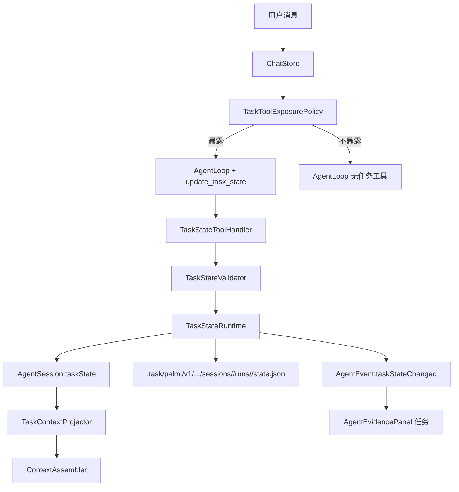

# PalmiAgent TaskState Runtime Spec

> 日期：2026-05-27  
> 状态：第二版设计，已复核 Codex 本地参考与 Claude Code 官方公开资料  
> 目标：为 PalmiAgent 增加结构化任务状态，让 Agent 能按需创建、更新、展示和持久化任务列表，同时避免隐藏延迟、循环失控和无意义 token 开销。

---

## 1. 结论

推荐采用 **Codex + Claude Code 混合方案**：

1. 不用后台轻量模型作为默认任务路由器。
2. 给主 Agent loop 增加一个内置、低成本、无副作用的 `update_task_state` 工具。
3. 主模型在执行过程中觉得任务复杂时，自己调用该工具创建或更新任务列表。
4. Runtime 接收结构化参数，校验后写入内存状态和隐藏文件 `.task/palmi/v1/.../sessions/<session-id>/runs/<task-run-id>/state.json`。
5. UI 只从结构化状态渲染「过程」里的任务 section，不从聊天文本解析 todo。

核心路径：

```text
User Turn
  -> TaskToolExposurePolicy 本地规则决定是否暴露 update_task_state
  -> AgentLoop 主模型正常执行
  -> 主模型按需调用 update_task_state
  -> TaskStateRuntime 校验、落盘、发事件
  -> 过程面板展示任务状态
  -> ContextAssembler 在后续请求中注入短 task projection
```

这比上一版“后台轻量模型并行探测”更稳。原因很直接：没有额外网络请求，没有看不见的等待，也更符合 Codex / Claude Code 的实际风格：任务列表是模型执行过程里的结构化动作，而不是外部裁判提前判断。

---

## 2. 参考结论

### 2.1 Codex

本地 `reference/codex-main` 里有明确实现：

1. `update_plan` 是一个工具，参数是 `explanation` 和 `plan`。
2. 每个 plan item 只有 `step` 和 `status`。
3. status 只有 `pending`、`in_progress`、`completed`。
4. 工具 handler 不做外部执行，只发送 `PlanUpdate` 事件并返回 `Plan updated`。
5. app/server protocol 会广播 `turn/plan/updated`。
6. SDK 把它映射成 `todo_list` item，TUI / SDK 消费 `item.started`、`item.updated`、`item.completed`。

Codex 的关键设计点不是“提前路由”，而是“主模型按需更新结构化 checklist，UI 监听事件”。

### 2.2 Claude Code

Claude Code 官方工具列表显示：

1. `TodoWrite` 是“管理 session task checklist”的内置工具。
2. 新版本又提供 `TaskCreate`、`TaskGet`、`TaskList`、`TaskUpdate`。
3. 这些任务类工具不需要用户审批。
4. 官方同时说明 Claude Code 内部 system prompt 不公开。

所以 Claude Code 的真实机制无法完全复刻，但公开边界说明它也是工具化任务状态，而不是普通文本 todo。

### 2.3 对 Palmi 的启发

Palmi 不应该直接照抄 Codex 的极简字段，因为我们需要隐藏细节、证据引用、计划/目标/深研适配。但运行方式应该学 Codex/Claude：主模型自己在合适时机调用任务工具，Runtime 负责结构化和展示。

---

## 3. 设计目标

1. 简单问题不触发任务，也不增加固定 token。
2. 复杂任务中途可以自然创建或更新任务列表。
3. 任务列表默认 2 到 6 项，硬上限 6 项。
4. 每项显示一句短任务，背后保留隐藏细节、验收目标、证据引用。
5. 任务状态可以被程序化校验、持久化、恢复和压缩投影。
6. 过程面板展示任务，不把完整 todo 列表刷进聊天正文。
7. 计划模式、目标模式、深度研究共享同一套 TaskState。
8. `update_task_state` 不能导致循环停不下来。

---

## 4. 非目标

1. 不做项目管理软件。
2. 不让后台轻量模型每轮偷偷判断。
3. 不让模型直接写 CSV / JSON 文件作为 canonical 状态。
4. 不从 assistant 普通文本里正则解析 todo。
5. 不为 planning、goal、deep research 做三套状态机。

---

## 5. 为什么不用默认轻量模型路由

上一版设计里，用户发消息后后台轻量模型判断 `noChange/create/revise`。这个思路有优点，但默认启用不适合 Palmi：

1. 它会产生看不见的网络调用和 token 成本。
2. 即使 soft deadline 只有 150 到 250 ms，也仍然可能变成首 token 延迟。
3. 用户追加消息时，router/reconciler 和主 loop 的时序会复杂。
4. 主模型其实最知道自己是否需要拆任务；外部 router 可能早判或误判。
5. Codex / Claude Code 的成熟做法都更接近“主模型工具化更新”。

轻量模型可以保留为后续增强能力，只在两个场景使用：

1. 用户显式选择「目标」或「深度研究」时，生成初始任务草案。
2. active task 与最终回复明显不一致时，异步做低优先级 reconciler。

第一阶段默认不启用。

---

## 6. 架构



### 6.1 新增模块

| 模块 | 职责 |
|---|---|
| `AgentTaskState.swift` | 数据模型 |
| `TaskToolExposurePolicy.swift` | 本地判断是否向主模型暴露任务工具 |
| `TaskStateToolHandler.swift` | 处理 `update_task_state` 内部工具 |
| `TaskStateRuntime.swift` | 内存状态、事件、落盘、加载 |
| `TaskStateValidator.swift` | 校验字段、状态转移、任务数量 |
| `TaskContextProjector.swift` | 生成短上下文投影 |
| `TaskStateFileStore.swift` | `.task/` 文件读写和 CSV 投影 |
| `TaskStateReconciler.swift` | 可选后处理，第一阶段默认关闭 |

---

## 7. 工具设计

工具名：`update_task_state`

工具定位：

1. 内置工具，不显示在工具管理列表。
2. 不需要用户审批。
3. 不执行外部动作，不访问网络，不修改用户文件，只更新 `.task/` 隐藏状态。
4. 工具返回短文本：`Task state updated` 或明确校验错误。

模型可见 schema：

```swift
struct UpdateTaskStateArgs: Codable, Sendable {
    var reason: String
    var lifecycle: AgentTaskLifecycle?
    var focusItemID: String?
    var items: [AgentTaskItemInput]
}

struct AgentTaskItemInput: Codable, Sendable {
    var id: String?
    var title: String
    var status: AgentTaskItemStatus
    var displaySummary: String?
    var hiddenDetail: String?
    var acceptanceCriteria: [String]?
    var evidenceToolUseIDs: [String]?
}
```

为什么用“全量 items”而不是复杂 patch：

1. 上限只有 6 项，全量列表更容易让模型保持一致。
2. Runtime 可以通过 id 做 diff，保留旧 hiddenDetail 和 evidence。
3. 避免 patch 操作太多导致 schema 膨胀。
4. 更接近 Codex 的 `update_plan`，实现和 UI 都更简单。

字段限制：

1. `title`：最多 24 个汉字或 48 个英文字符。
2. `displaySummary`：最多 80 个汉字。
3. `hiddenDetail`：最多 500 个汉字；未传时保留旧值。
4. `acceptanceCriteria`：最多 4 条，每条最多 80 个汉字。
5. `items`：2 到 6 项；更新已存在任务时允许 1 项，但 active list 总数仍不超过 6。
6. `reason`：最多 120 个汉字，记录为什么更新。

---

## 8. 暴露策略

`update_task_state` 不应该每轮都暴露。

### 8.1 必须暴露

1. 当前已有 active TaskState。
2. 用户显式说“计划、任务、todo、目标、深度研究、分步骤、分阶段”。
3. 当前 shell mode 是 professional，且输入命中多步任务动词：实现、修改、排查、调研、整理、生成、迁移、重构、验证。
4. 输入包含附件，且用户要求处理、总结、分析、提取、改写或生成产物。
5. 用户从附件菜单选择「计划 / 目标 / 深度研究」。

### 8.2 不暴露

1. 明显寒暄。
2. 简单知识问答。
3. 单句翻译或润色。
4. 用户只问状态、时间、设置说明。
5. 当前 chat surface，输入短且无任务动词。

### 8.3 拿不准时

专业模式下拿不准就暴露；聊天模式下拿不准就不暴露。

这能保证 professional 体验接近 Codex/Claude，chat 体验保持轻快。

---

## 9. 运行规则

### 9.1 创建

主模型第一次调用 `update_task_state` 时，Runtime 创建 `AgentTaskState`。

1. `mode` 默认为 `.auto`。
2. 第一项 `inProgress`，其余 `pending`。
3. 如果模型传了多个 `inProgress`，只保留第一个，其余降为 `pending`。
4. 如果模型全部传 `pending`，Runtime 把第一项改为 `inProgress`。
5. 如果当前 session 没有 active run，则创建新的 `taskRunID` 并写入 ledger。
6. 如果当前 run 已 `completed` / `abandoned`，新的有效任务请求不会覆盖旧 run，而是创建新 run。

### 9.2 更新

模型再次调用时传完整列表。

Runtime 行为：

1. 按 id 对齐旧 item。
2. 新 item 没有 id 时分配稳定 id：`t1`、`t2`。
3. 已完成 item 不允许删除；缺失时自动补回，标记 `completed`。
4. `completed` 不允许直接回 `pending`；必须变成 `inProgress` 或新增一项修正任务。
5. 完成项可以保留在列表底部，但 UI 默认折叠已完成。
6. 每次更新都刷新 `index.json` 中对应 run summary，但不把历史 run 全量读入上下文。

### 9.2.1 用户中途补充与改口

用户在 Agent 正在运行时追加消息，不能直接开新任务 run。

规则：

1. 追加消息先进现有 queued guidance。
2. 如果补充内容影响当前目标，主模型下一次循环可更新当前 run。
3. 如果补充内容只是插话或无关问题，当前 run 保持不变。
4. 如果用户明确推翻前一个目标，当前 run 进入 `abandoned`，或进入 `completed` 并在 summary 里说明目标已变更，然后创建新 run。
5. 如果用户要求“先别做这个，先做另一个”，当前 run 进入 `waitingForUser` 或 `blocked`，新 run 只有在用户明确切换目标时创建。

### 9.3 完成

当所有 item 都是 `completed` / `skipped` / `canceled`：

1. lifecycle 改为 `completed`。
2. 过程面板保留最终状态。
3. 后续普通 turn 默认不再向上下文注入完整任务，只保留一句 completed summary。

### 9.4 阻塞

如果审批被拒、权限不足、工具失败或用户要求暂停：

1. 当前 item 进入 `blocked`。
2. lifecycle 可进入 `blocked` 或 `waitingForUser`。
3. UI 过程图标显示警示态。
4. 后续用户给出补充后，模型可调用工具恢复为 `inProgress`。

---

## 10. 防循环设计

`update_task_state` 是最容易导致“模型一直更新计划、不干活”的工具，必须加硬限制。

硬限制：

1. 每个 turn 最多 3 次 `update_task_state`。
2. 连续两次 `update_task_state` 之间必须有普通 assistant 文本、外部工具调用、文件变化或 final reply；否则第二次返回限制错误。
3. 同一 revision 无实质变化时记为 no-op；同 turn no-op 最多 1 次。
4. 超过限制后，本 turn 不再暴露该工具，返回给模型：“task update limit reached; continue execution or provide final answer”。
5. AgentLoop 仍保留现有 iteration budget；task update 计入 iteration。
6. 如果一轮只有 task update，没有任何真实推进，最终回复必须说明当前计划，而不是继续循环。

UI 限制：

1. 不为每个 streaming delta 更新任务。
2. task event 合并到 item 状态变更级别。
3. 写文件 debounce 300 ms，turn 结束强制 flush。

---

## 11. 持久化与文件格式

任务状态不只存在 `agent-session.json`。Canonical 状态放在当前项目工作区的隐藏目录，但必须按 project / thread / session / task run 四层隔离：

```text
.task/
  palmi/
    v1/
      projects/
        <project-id>/
          threads/
            <thread-id>/
              sessions/
                <agent-session-id>/
                  index.json
                  current.json
                  events.jsonl
                  runs/
                    <task-run-id>/
                      state.json
                      tasks.csv
                      details/
                        t1.md
                        t2.md
```

这比 `.task/threads/<thread-id>/state.json` 更长，但必须这样做。当前 session 隔离还不够强，TaskState 不能默认相信“当前线程就是唯一身份”。路径和文件内容都必须携带身份信息，避免一个 thread、一个 workspace 或一次恢复流程把另一个 session 的任务状态读进来。

### 11.1 index.json 与 current.json

`index.json` 是一个 session 内的任务账本，只保存 run summary，不保存完整细节。

```json
{
  "schemaVersion": 1,
  "projectID": "UUID",
  "threadID": "UUID",
  "sessionID": "UUID",
  "currentRunID": "UUID",
  "runs": [
    {
      "taskRunID": "UUID",
      "title": "实现任务状态框架",
      "lifecycle": "completed",
      "createdAt": "2026-05-27T...",
      "updatedAt": "2026-05-27T...",
      "completedCount": 5,
      "totalCount": 5
    }
  ]
}
```

`current.json` 只保存当前 active run 指针和 revision，用于快速恢复，不作为最终事实来源。

### 11.2 state.json

每个 `runs/<task-run-id>/state.json` 是单个 task run 的 canonical 文件，App 更新任务时只写当前 run。

```json
{
  "schemaVersion": 1,
  "id": "UUID",
  "projectID": "UUID",
  "threadID": "UUID",
  "sessionID": "UUID",
  "taskRunID": "UUID",
  "mode": "auto",
  "lifecycle": "active",
  "revision": 4,
  "title": "实现任务状态框架",
  "summary": "为 Agent 增加可视化任务进度",
  "focusItemID": "t2",
  "items": []
}
```

### 11.3 tasks.csv

`tasks.csv` 是人类可读投影，不是 canonical 状态。

```csv
id,status,title,summary,updated_at
t1,completed,确认参考实现,已比较 Codex 和 Claude Code,2026-05-27T...
t2,in_progress,设计状态模型,定义任务字段和持久化,2026-05-27T...
```

用途：

1. 方便用户或开发者检查。
2. 方便未来导出。
3. UI 不依赖 CSV，避免 CSV 转义和结构损失。

### 11.4 details

长隐藏细节写到 `details/<task-id>.md`，`state.json` 里只存短摘要和路径。

规则：

1. 普通任务不写 details 文件，直接存在 JSON。
2. deep research 或超长验收条件才写 details。
3. details 文件只保存任务目标、验收标准、证据引用，不保存完整工具输出。

### 11.5 events.jsonl

追加式事件日志，用于审计和恢复。

```json
{"revision":2,"kind":"updated","reason":"用户要求先写设计文档","at":"..."}
{"revision":3,"kind":"item_completed","itemID":"t1","at":"..."}
```

### 11.6 Session 隔离硬规则

第一阶段必须承认：现有 session 隔离还不够强。所以 TaskState 自己要做防串线，而不是等后面整体 session 架构补齐。

规则：

1. 每次读写都必须带 `TaskStateIdentity(projectID, threadID, sessionID, taskRunID)`。
2. 路径里的 project / thread / session / run 必须与 JSON 内容完全一致。
3. `sessionID` 必须等于当前 `AgentSession.id`；不一致时拒绝加载，不做自动合并。
4. `projectID` 和 `threadID` 必须等于当前 `WorkspaceSelection`；不一致时视为外部文件或历史残留。
5. `TaskStateRuntime` 是 per active session 实例，线程切换时销毁或冻结旧实例。
6. 工具调用参数不允许携带 path，模型只能传结构化任务字段，路径由 Runtime 根据 identity 生成。
7. 写入使用 temp file + atomic replace；revision 不匹配时拒绝覆盖，写入冲突事件。
8. `AgentSession.taskStateSnapshot` 只做恢复兜底；只有 identity 匹配时才能恢复。
9. 如果 `.task/` 文件损坏、串 session 或 revision 回退，UI 显示“任务状态不可用”，不把错误状态注入上下文。

这套规则的目标不是解决整个 App 的 session 隔离问题，而是保证 TaskState 不成为新的串线源。

---

## 12. 数据模型

```swift
struct AgentTaskSessionLedger: Codable, Sendable {
    var schemaVersion: Int
    var projectID: UUID
    var threadID: UUID
    var sessionID: UUID
    var currentRunID: UUID?
    var runs: [AgentTaskRunSummary]
    var updatedAt: Date
}

struct AgentTaskRunSummary: Identifiable, Codable, Sendable {
    var id: UUID { taskRunID }
    var taskRunID: UUID
    var title: String
    var lifecycle: AgentTaskLifecycle
    var completedCount: Int
    var totalCount: Int
    var createdAt: Date
    var updatedAt: Date
}

struct AgentTaskState: Codable, Sendable {
    var schemaVersion: Int
    var id: UUID
    var projectID: UUID
    var threadID: UUID
    var sessionID: UUID
    var taskRunID: UUID
    var mode: AgentTaskMode
    var lifecycle: AgentTaskLifecycle
    var revision: Int
    var title: String
    var summary: String
    var focusItemID: String?
    var items: [AgentTaskItem]
    var metadata: AgentTaskModeMetadata
    var createdAt: Date
    var updatedAt: Date
}

enum AgentTaskMode: String, Codable, Sendable {
    case auto
    case planning
    case goal
    case deepResearch
}

enum AgentTaskLifecycle: String, Codable, Sendable {
    case active
    case waitingForUser
    case blocked
    case completed
    case abandoned
}

struct AgentTaskItem: Identifiable, Codable, Sendable {
    var id: String
    var title: String
    var status: AgentTaskItemStatus
    var displaySummary: String
    var hiddenDetail: String?
    var detailPath: String?
    var acceptanceCriteria: [String]
    var evidenceReferences: [AgentTaskEvidenceRef]
    var updatedAt: Date
}

enum AgentTaskItemStatus: String, Codable, Sendable {
    case pending
    case inProgress
    case completed
    case blocked
    case skipped
    case canceled
}

struct AgentTaskEvidenceRef: Codable, Sendable {
    var kind: EvidenceReferenceKind
    var toolUseID: String?
    var fileDeltaID: UUID?
    var eventLogID: UUID?
    var title: String
}
```

---

## 13. Context 投影

`TaskContextProjector` 只在 active / blocked / waitingForUser 时注入短上下文。

默认投影：

```text
当前任务状态：
目标：实现任务状态框架
状态：active
当前：t2 设计状态模型
待办：t3 接入过程面板；t4 写入 .task 文件
已完成：t1 确认参考实现
约束：最多 6 项；不要把任务列表重复写进最终回复。
```

限制：

1. 默认不超过 400 tokens。
2. deep research 不超过 900 tokens。
3. 不投影完整 details。
4. 不投影 `events.jsonl`。
5. completed lifecycle 后只投影一句摘要，或完全不投影。

---

## 14. UI 设计

入口：复用当前底部「过程」图标。

过程面板新增第一段「任务」，但只展示当前 session 的 task ledger。

```text
任务
  当前任务
  实现任务状态框架                         2 / 5
  [完成]   确认参考实现
  [进行中] 设计状态模型
  [待办]   接入过程面板

  历史任务  7
  最近完成：整理模型供应商配置、修复附件导入、生成研究摘要
```

规则：

1. 没有 TaskState 时，不显示任务 section。
2. 有 active / blocked task 时，任务 section 默认展开。
3. 每行只显示状态、标题、短摘要。
4. 点开 item 才显示隐藏细节、验收标准、证据引用。
5. 过程按钮可以显示小进度：`2/5` 或环形进度。
6. blocked 显示警示态，completed 显示普通态。

### 14.1 当前任务

当前任务区域只服务一个 active run。

视觉层级：

1. 顶部：任务标题、生命周期状态、进度。
2. 中间：2 到 6 个 task item，固定行高，状态图标 + 标题 + 一行摘要。
3. 底部：最近一次更新时间和“本轮更新 N 次”的轻提示。

交互：

1. 默认展开当前任务。
2. 已完成项默认可见，但颜色降低；超过 4 项时折叠已完成项。
3. 点击 item 展开详情，显示 hidden detail、acceptance criteria、evidence refs。
4. 点击 evidence ref 跳到过程面板里对应工具、文件或引用记录。
5. blocked item 高亮，但不弹 toast，不打断聊天。

### 14.2 历史任务

一个 session 里可以触发多次任务。比如累计 50 个 task run，UI 不能线性堆满。

规则：

1. 当前 active run 永远置顶。
2. 历史任务默认折叠，只显示数量和最近 3 个标题。
3. 展开历史后，最多先加载 20 个 run summary。
4. 超过 20 个用分页或虚拟列表，不一次性读取全部 `state.json`。
5. 历史 run 默认只显示 summary；用户点开才加载对应 run 的 `state.json`。
6. completed / abandoned / blocked 历史 run 用不同轻量状态标记，但不抢当前任务视觉焦点。

### 14.3 高频更新

一轮对话内 task 更新 5 次，UI 不展示 5 份列表，只展示最新 state。

规则：

1. 同一个 run 的多次 revision 合并显示为最新状态。
2. 详情里可以看到“本轮更新 N 次”。
3. 事件页可以查看完整 events，但默认按 item 级别合并。
4. 进度变化使用轻量过渡，不做大面积动画。
5. session 切换时立即清空旧 snapshot，再加载新 session ledger，避免视觉串线。

### 14.4 好看但不花哨

这个 UI 应该像专业工作台，不像项目管理大屏。

设计原则：

1. 任务区域是过程面板里的一个 compact section，不做大卡片堆叠。
2. 状态用小图标、小色点和短标签，不用大面积彩色背景。
3. 字号跟现有过程面板一致，标题略重，摘要弱化。
4. 宽度不足时摘要截断，详情放展开层，不能挤压聊天主界面。
5. 视觉重点只给 active / blocked item，completed item 退后。
6. 50 个历史 run 的存在感应该是“可追溯”，不是“占屏”。

---

## 15. Planning / Goal / Deep Research

三种模式不单独建框架，只改变 `mode` 和 `metadata`。

### 15.1 Planning

1. `mode = .planning`。
2. lifecycle 先是 `waitingForUser`。
3. 工具可写任务计划，但不执行文件修改或系统动作。
4. 用户确认后转 `active`。
5. 用户拒绝后转 `abandoned` 或要求模型 revise。

### 15.2 Goal

1. `mode = .goal`。
2. 可以跨多 turn 保持 active。
3. 用户插入普通问题时，goal 不自动取消。
4. 用户明确取消、目标完成或长期阻塞时才结束。
5. 第一阶段不做后台唤醒，只做线程内持久目标。

### 15.3 Deep Research

1. `mode = .deepResearch`。
2. 顶层任务仍最多 6 项。
3. 来源、证据缺口、引用要求放在 metadata 和 evidence refs。
4. 复用现有 `ToolArtifactPipeline` 和 `ResearchSynthesisArtifact`。
5. 不把每篇来源变成一个 task item，避免列表膨胀。

---

## 16. Token 与延迟预算

### 16.1 简单聊天

1. 不暴露 `update_task_state`。
2. 不调用轻量模型。
3. 不注入 task projection。

额外 token：0。额外网络延迟：0。

### 16.2 复杂任务但未 active

1. 暴露一个小型内部工具 schema。
2. schema 预算目标：200 到 350 tokens。
3. 模型是否调用由主模型决定。

额外延迟：无额外网络请求；只有主模型可能多一次工具 roundtrip。

### 16.3 active task

1. 暴露工具 schema。
2. 注入 150 到 400 tokens 的 task projection。
3. 每次状态更新写入 `.task/`，但 debounce。

### 16.4 深度研究

1. projection 上限 900 tokens。
2. evidence 只传摘要和引用，不传原文。
3. 来源细节仍由 hidden artifacts 管理。

---

## 17. 失败处理

| 情况 | 行为 |
|---|---|
| 工具参数 JSON 非法 | 返回校验错误，不更新状态 |
| 任务超过 6 项 | 拒绝更新，要求合并 |
| 多个 inProgress | 自动保留第一个，其余降为 pending |
| 删除 completed item | 自动补回 |
| 写 `.task/` 失败 | 保留内存状态，过程面板显示，但 event log 记录失败 |
| 会话恢复找不到 `.task/` | 从 `AgentSession.taskStateSnapshot` 恢复最小状态 |
| `.task/` 与 session 不一致 | 拒绝加载，标记 task state unavailable，不做自动合并 |
| 同 session 同 run revision 冲突 | revision 高者胜；冲突写入 `events.jsonl` |
| update 工具循环 | 触发 turn 内 update 限制，要求继续执行或收尾 |

---

## 18. 复杂场景鲁棒性

TaskState 不按“用户人格”判断，不做心理标签。它只处理输入行为和状态转移。下面是必须覆盖的基础场景。

| 场景 | 期望行为 |
|---|---|
| 寒暄、单句问答 | 不暴露工具，不创建任务 |
| 明确复杂任务 | 暴露工具，允许主模型创建 2 到 6 项任务 |
| 用户中途追加约束 | 更新当前 run，不新建 run |
| 用户插入无关问题 | 当前 run 保持 active，回答插话后继续 |
| 用户频繁改口 | 保留最新目标，旧项 completed / skipped / abandoned，必要时创建新 run |
| 用户推翻整个目标 | 当前 run abandoned，新目标创建新 run |
| 用户要求暂停 | lifecycle 进入 waitingForUser |
| 用户要求取消 | lifecycle 进入 abandoned |
| 用户催促“别废话快做” | 不强制展示计划，继续执行；已有任务只做必要更新 |
| 用户问“现在做到哪了” | 读取当前 TaskState，回答当前项和进度 |
| 模型忘记更新任务但已经做完 | final 前的 completion guard 要求补一次状态或在回复里说明未同步 |
| 工具失败或审批拒绝 | 当前 item blocked，UI 显示阻塞 |
| session 切换 | 旧 runtime 冻结，新 runtime 只加载新 session ledger |
| 文件损坏或身份不匹配 | 不注入上下文，不展示错误任务 |
| 单 session 累计 50 个 run | 当前 run 置顶，历史 run 折叠、懒加载、按 summary 展示 |

### 18.1 鲁棒性边界

能保证的：

1. 任务不会因为普通聊天自动泛滥。
2. 任务不会因为模型连续更新而卡死在 loop 里。
3. 任务不会因为 session 切换直接串到别的会话。
4. 复杂任务可以中途修改、暂停、取消、重开。
5. UI 可以承接几十个历史 run，但不会一次性渲染全部细节。

不能承诺的：

1. 模型每次都能完美拆解任务。
2. 用户极端频繁改目标时，任务语义永远优雅。
3. session 总体隔离问题在 TaskState 之外完全解决。

因此第一阶段验收重点是“不会错乱、不会卡死、不会明显拖慢、能恢复”，而不是“每个任务标题都完美”。

---

## 19. 与现有代码的落点

| 文件 | 修改 |
|---|---|
| `Core/Agent/AgentTaskState.swift` | 新增模型 |
| `Core/Agent/TaskStateRuntime.swift` | 新增运行时 |
| `Core/Agent/TaskStateFileStore.swift` | 新增 `.task/` 读写 |
| `Core/Agent/TaskStateToolHandler.swift` | 新增内部工具处理 |
| `Core/Agent/TaskToolExposurePolicy.swift` | 新增暴露策略 |
| `Core/Agent/TaskContextProjector.swift` | 新增上下文投影 |
| `Core/Agent/AgentModels.swift` | 增加 `taskStateSnapshot` 和 task events |
| `Core/Agent/AgentLoop.swift` | 接入工具、预算、事件 |
| `Core/Agent/ContextAssembler.swift` | 注入 task projection |
| `Features/Chat/AgentEvidenceSnapshot.swift` | 增加 task snapshot |
| `Features/Chat/AgentEvidencePanel.swift` | 增加任务 section |
| `Features/Chat/ChatStore.swift` | 消费 task events，触发持久化 |
| `SharedUI/AttachmentImportUI.swift` | 启用计划/目标/深研入口 |

---

## 20. 验收标准

1. 输入「你好」不暴露任务工具、不创建 `.task/`、不增加上下文。
2. 输入复杂实现需求时，主模型可以中途创建 2 到 6 项任务。
3. 任务更新后，过程面板立即显示进度。
4. `.task/palmi/v1/projects/<project-id>/threads/<thread-id>/sessions/<session-id>/runs/<task-run-id>/state.json` 是可恢复的 canonical 状态。
5. `tasks.csv` 能反映用户可见任务行，但 UI 不依赖它。
6. 用户中途修改目标时，模型能更新任务而不是重开一份。
7. 完成任务后 lifecycle 进入 completed，后续不再污染上下文。
8. 连续 plan update 不会导致 loop 停不下来。
9. deep research 能把 evidence refs 绑定到任务项。
10. sessionID 不匹配的 task 文件不会被加载或注入上下文。
11. 单 session 50 个历史 run 时，过程面板仍只默认展示当前 run 和历史摘要。

---

## 21. 最终取舍

这一版不是纯 Codex，也不是纯 Claude Code。

纯 Codex 太轻：只有 `step + status`，不够 Palmi 的过程面板、隐藏细节和研究证据。  
纯 Claude Code 不透明：官方公开的是工具边界，内部 prompt 不公开，不适合盲抄。  
Palmi 应该采用 **Codex 的结构化事件流 + Claude 的模型自发任务工具使用 + Palmi 自己的持久化和证据层**。

关键原则：

1. 默认没有隐藏模型调用。
2. 任务由主模型在执行中按需创建。
3. Runtime 只接受结构化工具参数。
4. Canonical 状态写 `.task/`，UI 只读结构化状态。
5. 硬限制防止任务更新循环。
