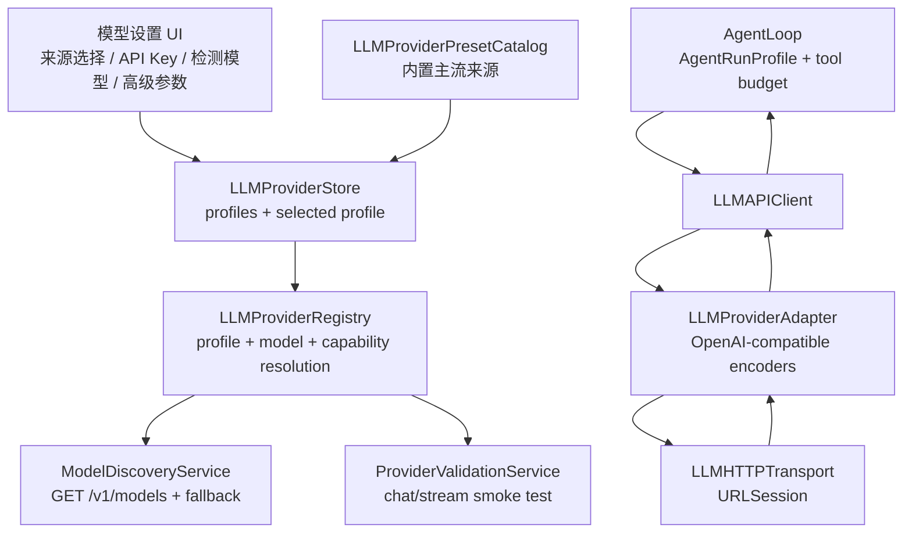

# PalmiAgent LLM Provider Runtime 重构 Spec

> 日期：2026-05-18，更新：2026-05-19  
> 状态：第一阶段已落地，后续继续拆 AgentLoop budget 与完整 provider adapter  
> 参考代码：`reference/cc-switch-main`、`reference/codex-main`  
> 约束：只做 OpenAI-compatible 接入层；不做 Anthropic/Gemini native；不做模型中转；不接 ChatGPT Plus/Claude Pro 绕行通道。

---

## 1. 结论

当前 PalmiAgent 的大模型接入层还是“少量供应商枚举 + 少量硬编码模型 + 一个 Chat Completions 请求体”。这在只有 GLM、DeepSeek、LM Studio 三家时可用，但无法承载后续几十个官方/主流平台、模型自动发现、供应商差异、原生 reasoning 参数、工具历史兼容和后续 AgentLoop 预算管理。

2026-05-19 第一阶段已完成的边界：

1. 已把 provider 列表扩到官方/主流 OpenAI-compatible 来源，但 UI 不再显示解释性副文案。
2. 已把配置管理改成“用户创建的 profile 才在大模型管理中出现”，未创建过的 provider 不再默认铺满列表。
3. 已允许删除用户创建的最后一个 profile；删除后只保留运行时 fallback，不出现在管理列表。
4. 已引入 `LLMProviderRuntimeProfile` / `LLMModelCapabilities` / `LLMNativeReasoningEncoding`。
5. 已将 Agent 强度映射到模型原生 reasoning 请求参数，但仍保留 AgentLoop 预算语义；下一阶段要拆成两个独立控制面。
6. 已接入 DeepSeek/Kimi/Qwen/MiniMax/GLM/OpenAI 的 native reasoning 编码分流。
7. 已按 cc-switch 的 `model_fetch.rs` 思路补齐 `/models` 候选 URL 和兼容后缀剥离。

本次重构应该把 LLM 接入层改成：

1. **Provider 是数据，不是 enum 分支。**  
   内置供应商只是 preset；用户保存的是 provider profile。

2. **Model 能力是 metadata，不是字符串列表。**  
   每个模型要有 context、output、tool calling、vision、native reasoning、reasoning replay、streaming、JSON mode 等能力。

3. **Reasoning 控制分两层。**  
   模型原生 reasoning 参数由 provider/model adapter 编码；Agent 任务预算由 AgentRunProfile 控制。现在的 `极速/效率/均衡/质量/极致` 混在一起，需要拆开。

4. **请求构造走 canonical request -> adapter -> HTTP。**  
   Palmi 内部只维护统一的 `PalmiLLMRequest`；不同供应商通过 adapter 注入 `thinking`、`reasoning_effort`、`enable_thinking`、`reasoning_split`、`extra_body` 等字段。

5. **UI 不按品牌做独立配置页。**  
   用户选一个来源，填 API Key，点击“检测模型”；baseURL、modelsURL、extra headers 放高级配置。不要每家供应商一套 UI。

6. **CCSwitch 可以学设计，不建议直接搬代码。**  
   它是 MIT 协议，可以复用思路甚至代码片段，但 Palmi 是 Swift/iOS 原生应用，最好重写结构；如直接复制实现片段，需要保留 MIT license notice。

---

## 2. 已读参考代码范围

这次重点读取的是 CCSwitch 的 LLM/provider 全链路，而不是只看 README：

| 代码区域 | 已确认的设计点 |
|---|---|
| `src/types.ts` | ProviderCategory、Provider、ProviderMeta、UniversalProvider、OpenCode model variants |
| `src-tauri/src/provider.rs` | Rust 侧 Provider/ProviderMeta 与前端结构对应 |
| `src-tauri/src/database/schema.rs` | providers、provider_endpoints、provider_health、proxy_request_logs、model_pricing、stream_check_logs 分表 |
| `src-tauri/src/database/dao/providers.rs` | Provider 保存、读取、custom endpoints 从 meta 中拆分 |
| `src/config/*ProviderPresets.ts` | preset 是数据模板，包含 baseURL、auth、model、endpointCandidates、category、theme |
| `src/config/opencodeProviderPresets.ts` | model variants 把 reasoningEffort/thinkingConfig 放在模型变体 metadata 上 |
| `src/components/providers/forms/*` | 一个通用 ProviderForm 承载 preset、API Key、baseURL、模型拉取、高级配置 |
| `src/lib/api/model-fetch.ts` | 前端统一调用模型列表拉取，错误分类给用户 |
| `src-tauri/src/services/model_fetch.rs` | OpenAI-compatible `GET /v1/models`，带 candidate URL fallback |
| `src-tauri/src/proxy/providers/adapter.rs` | ProviderAdapter trait：baseURL、auth、URL、headers、request/response transform |
| `src-tauri/src/proxy/providers/codex.rs` | OpenAI/Codex URL 拼接、Bearer auth、配置提取 |
| `src-tauri/src/proxy/providers/transform.rs` | reasoning_effort 支持检测，reasoning_content 选择性保留 |
| `src-tauri/src/proxy/providers/transform_responses.rs` | Responses API reasoning.effort、Codex OAuth 特殊约束 |
| `src-tauri/src/proxy/body_filter.rs` | 递归过滤 `_` 私有参数，防止内部字段发给上游 |
| `src-tauri/src/proxy/provider_router.rs` | provider 健康状态、failover queue、circuit breaker |
| `src-tauri/src/proxy/forwarder.rs` | provider attempt、adapter transform、模型映射、私有字段过滤、健康记录 |
| `src-tauri/src/services/stream_check.rs` | 流式健康检查、模型名 `model@effort` 解析、URL fallback、错误分类 |
| `reference/codex-main` | Codex 的 `ModelInfo`/`ReasoningEffort` 证明 reasoning 是模型能力，不是全局 Agent 档位 |

Palmi 当前对照代码：

| 文件 | 当前问题 |
|---|---|
| `PalmiAgent/Core/Configuration/APIConfigurationStore.swift` | `APIProviderID` 只有 `glm/deepseek/lmstudio`，provider 和 model 都硬编码 |
| `PalmiAgent/Integrations/Intelligence/OpenAICompatibleAgentTransport.swift` | 请求体只有 model/messages/tools/tool_choice/temperature/stream |
| `PalmiAgent/Integrations/Intelligence/LLMAPIClient.swift` | 直接拼 `chat/completions`，无 provider adapter，无 native reasoning 参数 |
| `PalmiAgent/Core/Agent/AgentModels.swift` | `AgentMessage` 没有 native reasoning metadata，无法安全 replay `reasoning_content` |
| `PalmiAgent/Core/Agent/ReasoningStrengthProfile.swift` | “强度”实际控制 iteration/web/context，`.infinite` 到 1000 次，不是模型原生 reasoning |
| `PalmiAgent/Core/Agent/AgentLoop.swift` | 工具顺序执行，budget 与 provider/model capability 未解耦 |

---

## 3. 范围与非目标

### 3.1 本次重构范围

1. 重建 provider/profile/model/capability 数据模型。
2. 建 OpenAI-compatible adapter 层。
3. 增加模型发现和连接测试。
4. 重建 reasoning 控制：模型原生参数 + Agent 任务预算分离。
5. 迁移现有 GLM、DeepSeek、LM Studio 配置。
6. 为后续 AgentLoop 重构预留 provider/model capability 输入。

### 3.2 非目标

1. 不做 Anthropic native Messages API。
2. 不做 Gemini native API。
3. 不接 ChatGPT Plus/Claude Pro/OAuth 绕行方案。
4. 不做 CCSwitch 那种桌面代理 server/failover proxy。
5. 不一次性接所有小型第三方、返利站、商业合作站。
6. 不把 provider UI 做成每个品牌一个页面。
7. 不把 AgentLoop 多工具并发和权限系统一起塞进本次第一阶段。

---

## 4. CCSwitch 值得借鉴的设计哲学

### 4.1 Provider 是数据，不是代码分支

CCSwitch 的 Provider 结构基本是：

```text
Provider
  id
  name
  category
  settings_config
  meta
  website_url
  icon/theme
  in_failover_queue
```

它没有为每个供应商做一个单独页面。供应商差异主要放在 preset、meta、adapter 和测试配置里。

Palmi 应该学习这一点：内置供应商是 `ProviderPreset`，用户保存的是 `ProviderProfile`。`APIProviderID.glm/deepseek/lmstudio` 不能继续作为核心抽象。

### 4.2 Preset 和用户 profile 分离

CCSwitch preset 负责“给用户一个起点”：baseURL、auth 模板、model、endpointCandidates、category、icon、notes。用户 profile 才是可编辑和可持久化的真实配置。

Palmi 要做：

```text
LLMProviderPreset  ->  新建/填充  ->  LLMProviderProfile
内置、可升级             用户保存、可改名、可检测、可选模型
```

升级 preset 不应该覆盖用户 profile。

### 4.3 模型拉取是接入层第一等能力

CCSwitch 的 `model_fetch.rs` 做了几件事：

1. 使用 OpenAI-compatible `GET /v1/models`。
2. baseURL 已带 `/v1` 时拼 `/models`。
3. baseURL 是完整 URL 时尝试反推出 `/v1/models`。
4. 遇到兼容子路径时剥离后缀再尝试。
5. 401/403、404/405、timeout、parse failure 都做用户可理解错误。

Palmi 要同样做模型检测。用户不应该被要求先知道模型 ID；应该先粘 API key，再点“检测模型”。

### 4.4 Adapter 抽象必须在 HTTP 之前

CCSwitch 的 `ProviderAdapter` 只管几类核心动作：

```text
extract_base_url
extract_auth
build_url
get_auth_headers
needs_transform
transform_request
transform_response
```

Palmi 应该扩展成 Swift 版：

```swift
protocol LLMProviderAdapter {
    func buildEndpoint(profile: LLMProviderProfile, operation: LLMOperation) throws -> URL
    func buildHeaders(profile: LLMProviderProfile) throws -> [String: String]
    func encodeRequest(_ request: PalmiLLMRequest, profile: LLMProviderProfile, model: LLMModelDescriptor) throws -> Data
    func decodeResponse(_ data: Data, profile: LLMProviderProfile, model: LLMModelDescriptor) throws -> PalmiLLMResponse
    func decodeStreamEvent(_ data: Data, profile: LLMProviderProfile, model: LLMModelDescriptor) throws -> PalmiLLMStreamEvent?
}
```

### 4.5 Reasoning 属于模型能力，而不是全局档位

CCSwitch 的 OpenCode preset 里，模型 variant 会写：

```text
OpenAI: reasoningEffort low/medium/high/xhigh
Gemini: thinkingConfig thinkingBudget/thinkingLevel
Anthropic: effort 或 thinking.budgetTokens
```

Codex 代码里也有 `ModelInfo.supported_reasoning_levels` 和 `default_reasoning_level`。

结论：Palmi 不能把“快速/正常/专家”直接当成模型强度。它们现在更像 Agent 预算，不是模型 native reasoning。

### 4.6 reasoning_content 不能无脑转发

CCSwitch 对 `reasoning_content` 很谨慎：只对明确需要的 Kimi/DeepSeek 这类 OpenAI-compatible provider 保留；通用 OpenAI-compatible 不发非标准字段，避免严格后端 400。

Palmi 后续需要：

1. response decoder 能读 `reasoning_content` / `reasoning_details`。
2. `AgentMessage` 能存 hidden native reasoning metadata。
3. request encoder 只在 provider/model 声明需要 replay 时，把该字段放回 assistant tool-call 历史。

---

## 4.7 官方文档核对结论

| Provider | 官方结论 | Palmi 当前实现 |
|---|---|---|
| OpenAI | Chat Completions 支持 `reasoning_effort`；不同 reasoning model 支持值不同。 | 对 OpenAI/Azure reasoning model 写入 `reasoning_effort`；不支持值会降级。 |
| GLM / Z.AI | GLM-4.5 起支持 `thinking.type = enabled/disabled`。 | 对 GLM-4.5/4.6/4.7/5 系列写入 `thinking.type`。 |
| DeepSeek | Chat Completion 响应包含 `reasoning_content`；thinking 历史需要保留。 | 标记 `supportsReasoningReplay = true`，并保留 reasoning 字段历史。 |
| Qwen / DashScope | OpenAI-compatible Chat Completion 可用 `enable_thinking`，可配 `thinking_budget`。 | 对 Qwen3/QwQ 写入 `enable_thinking` / `thinking_budget`。 |
| Kimi / Moonshot | Kimi thinking 模型通过 `reasoning_content` 承载推理；Kimi K2.5 固定 `temperature = 1.0`。 | Kimi thinking 模型启用 reasoning replay，并强制 temperature 为 1。 |
| MiniMax | OpenAI-compatible 格式支持 `reasoning_split=True`，推理内容在 `reasoning_details`。 | M2 系列写入 `reasoning_split`。 |
| 腾讯混元 | 官方 OpenAI 兼容接口 base URL 为 `https://api.hunyuan.cloud.tencent.com/v1`。 | 使用 catalog-managed endpoint。 |
| 百度千帆 | V2 模型服务兼容 OpenAI，base URL 为 `https://qianfan.baidubce.com/v2`。 | 使用 catalog-managed endpoint。 |
| StepFun | OpenAI 兼容 base URL 为 `https://api.stepfun.ai/v1` / 国内站 `https://api.stepfun.com/v1`；支持 `reasoning_format`。 | 使用国内站 `https://api.stepfun.com/v1`；请求体编码 `reasoning_format = deepseek-style`。 |
| SiliconFlow | `/v1/models` 返回 OpenAI-compatible model list。 | 模型检测按 `/v1/models` 获取。 |

当前没有 API Key，无法做真实 paid endpoint live test；已完成的是官方文档和本地请求构造层验证。

---

## 5. 新架构

### 5.1 模块图



### 5.2 数据模型

```swift
struct LLMProviderPreset: Identifiable, Codable, Sendable {
    let id: String
    let displayName: String
    let category: LLMProviderCategory
    let websiteURL: URL?
    let apiKeyURL: URL?
    let defaultBaseURL: URL?
    let modelsURL: URL?
    let endpointCandidates: [URL]
    let auth: LLMAuthPreset
    let apiFormat: LLMAPIFormat
    let knownModels: [LLMModelDescriptor]
    let notes: String?
}

struct LLMProviderProfile: Identifiable, Codable, Sendable {
    let id: UUID
    var presetID: String?
    var displayName: String
    var category: LLMProviderCategory
    var baseURL: URL
    var modelsURL: URL?
    var authRef: LLMSecretRef
    var selectedModels: [LLMModelRole: String]
    var discoveredModels: [LLMModelDescriptor]
    var capabilityOverrides: LLMProviderCapabilityOverrides
    var requestOptions: LLMProviderRequestOptions
    var health: LLMProviderHealthSnapshot?
    var updatedAt: Date
}

struct LLMModelDescriptor: Identifiable, Codable, Hashable, Sendable {
    let id: String
    var displayName: String
    var ownedBy: String?
    var contextWindow: Int?
    var maxOutputTokens: Int?
    var modalities: LLMModalities
    var capabilities: LLMModelCapabilities
    var nativeReasoning: LLMNativeReasoningSpec
}
```

### 5.3 Provider 分类

```swift
enum LLMProviderCategory: String, Codable, Sendable {
    case officialGlobal
    case officialChina
    case cloudPlatform
    case reputableAggregator
    case localRuntime
    case custom
}
```

不要照抄 CCSwitch 的 `third_party/partner/omo`。Palmi 当前不是 provider 返利入口，也不是桌面 CLI 管理器。

### 5.4 API 格式

第一阶段只支持：

```swift
enum LLMAPIFormat: String, Codable, Sendable {
    case openAICompatibleChatCompletions
}
```

预留但不启用：

```swift
case openAIResponses
case anthropicMessages
case geminiNative
```

原因：用户明确要求先做 OpenAI 适配；国内厂商最广的是 OpenAI-compatible Chat Completions。Responses API 可以给 OpenAI/Codex 以后做，但第一阶段不要把协议面铺太大。

---

## 6. 推荐首批适配列表

原则：

1. 官方直供优先。
2. 国内叫得上牌子、正规平台优先。
3. 大型/有背景聚合平台少量保留。
4. 本地 runtime 保留。
5. 小型商业中转、返利站、Coding Plan 灰色站暂缓。

### 6.1 首批内置 preset

| 分组 | Provider | 默认 baseURL 策略 | 备注 |
|---|---|---|---|
| 全球官方 | OpenAI | `https://api.openai.com/v1` | 第一阶段走 Chat Completions；Responses 后续再开 |
| 全球云 | Azure OpenAI | 用户填 resource endpoint | 官方云，配置复杂，放高级 |
| 国内官方 | DeepSeek | `https://api.deepseek.com` | OpenAI-compatible；需要处理 reasoning_content |
| 国内官方 | Zhipu GLM / Z.AI | `https://open.bigmodel.cn/api/paas/v4` | OpenAI-compatible；thinking 开关模型相关 |
| 国内官方 | Alibaba Cloud Model Studio / DashScope / Qwen | 官方 OpenAI-compatible endpoint | Qwen thinking 参数要单独 encoder |
| 国内官方 | Moonshot Kimi | 官方 OpenAI-compatible endpoint | Kimi K 系列 reasoning/tool replay 要谨慎 |
| 国内官方 | MiniMax | 官方 OpenAI-compatible endpoint | `reasoning_split` / `reasoning_details` |
| 国内官方 | Volcengine Ark / Doubao | 官方 OpenAI-compatible endpoint | 火山方舟，国内主流 |
| 国内官方 | Tencent Hunyuan | 官方 OpenAI-compatible endpoint | 混元，国内主流 |
| 国内官方 | Baidu Qianfan / Wenxin | 官方 OpenAI-compatible endpoint | 千帆，国内主流 |
| 国内官方 | StepFun | 官方 OpenAI-compatible endpoint | 阶跃星辰，国内主流 |
| 国内平台 | ModelScope | 官方/平台 OpenAI-compatible endpoint | 魔搭平台，适合开源模型 |
| 大型聚合 | SiliconFlow | `https://api.siliconflow.cn/v1` | 国内主流模型平台 |
| 大型聚合 | OpenRouter | `https://openrouter.ai/api/v1` | 全球主流聚合，用户自担合规 |
| 本地 | LM Studio | `http://host:1234/v1` | 继续保留 discovery |
| 本地 | Ollama | `http://host:11434/v1` | 只支持其 OpenAI-compatible `/v1` |
| 自定义 | Custom OpenAI-compatible | 用户填 baseURL | 兜底 |

### 6.2 明确暂缓

从 CCSwitch 里看到的 PackyCode、AIGoCode、RightCode、RunAPI、Micu、CrazyRouter、SSSAiCode、E-FlowCode、Pipellm、各种 Codex/Coding Plan 专站，不放首批内置 preset。

理由：

1. 很多是商业合作/返利站，不适合作为 Palmi 默认背书。
2. 一些可能是 Coding Plan 或 CLI 绕行服务，不符合 Palmi “不做中转、不碰灰色接入”的定位。
3. 用户仍然可以通过 Custom OpenAI-compatible 手动接入，但 Palmi 不主动推荐。

---

## 7. Reasoning 重构

### 7.1 拆成两套控制

当前 `ReasoningStrengthProfile` 同时控制：

1. Agent loop 最大 iteration。
2. Web search 数量。
3. Web fetch 字符数。
4. Context compaction target。
5. UI 上所谓“思考强度”。

这不是模型 reasoning。新方案拆成：

```text
Model Reasoning Control
  发送给模型的原生参数：reasoning_effort / thinking.type / enable_thinking / reasoning_split ...

Agent Run Profile
  Palmi 自己的任务预算：LLM 调用数、工具数、耗时、web 数量、上下文策略、确认点 ...
```

### 7.2 UI 层命名

普通用户只看：

```text
任务模式：快速 / 标准 / 深入 / 长任务
```

高级用户才看：

```text
模型思考：自动 / 关闭 / 低 / 中 / 高 / 最大
```

实际展示要由当前模型 capability 决定。比如 GLM 只有 thinking on/off，就不要显示低/中/高；OpenAI GPT-5/o 系模型支持 low/medium/high/xhigh 才显示完整档。

### 7.3 Agent Run Profile

```swift
struct AgentRunProfile: Codable, Sendable {
    let id: String
    let title: String
    let maxLLMCalls: Int
    let maxToolCalls: Int
    let maxWallClockSeconds: Int
    let maxConsecutiveFailures: Int
    let webSearchLimit: Int
    let webFetchCharacterLimit: Int
    let requiresContinuationConfirmation: Bool
}
```

建议语义：

| UI | Agent 预算语义 |
|---|---|
| 快速 | 少量工具机会，快速回答 |
| 标准 | 默认，多数任务足够 |
| 深入 | 允许更多搜索/文件读取/验证 |
| 长任务 | 分阶段执行，每阶段需要确认 |

`maxIterations = 1000` 只可作为内部 hard cap，不应作为“极致”用户档位。

### 7.4 Native Reasoning Spec

```swift
enum LLMNativeReasoningSpec: Codable, Hashable, Sendable {
    case unsupported
    case openAIReasoningEffort(levels: Set<LLMReasoningEffort>, defaultLevel: LLMReasoningEffort)
    case thinkingSwitch(defaultEnabled: Bool)
    case thinkingBudget(min: Int?, max: Int?, defaultBudget: Int?)
    case providerSpecific(LLMProviderReasoningEncoding)
}

enum LLMReasoningEffort: String, Codable, CaseIterable, Sendable {
    case off
    case minimal
    case low
    case medium
    case high
    case xhigh
    case auto
}
```

### 7.5 Provider 编码矩阵

| Provider/模型族 | UI 能力 | 请求编码建议 | 响应/历史处理 |
|---|---|---|---|
| OpenAI GPT-5/o 系 | low/medium/high/xhigh | Chat compatible 可用 `reasoning_effort`；Responses 后续用 `reasoning.effort` | 默认不 replay 非标准 reasoning 字段 |
| DeepSeek reasoner/pro | on/off 或 high | 按官方 OpenAI-compatible reasoning 字段；如果返回 `reasoning_content`，只在需要 tool replay 的模型中保存/回放 | `AgentMessage` 存 hidden native reasoning |
| GLM/Z.AI | on/off/auto | `thinking.type = enabled/disabled` 或 provider 当前官方字段 | 不假设 low/medium/high |
| Qwen/DashScope | on/off/budget | `enable_thinking`、`thinking_budget` 或官方兼容字段 | 需要保存 `reasoning_content` 时按 capability 开启 |
| Kimi/Moonshot | on/off/model dependent | 取决于模型族；K 系列可能需要 thinking/reasoning_content 兼容 | 只对 Kimi capability 开 replay |
| MiniMax | split/details | `reasoning_split = true` 获取 `reasoning_details` | decoder 解析 `reasoning_details`，默认 UI 隐藏 |
| SiliconFlow/OpenRouter | pass-through/unknown | 默认不发送 provider-specific 字段；仅对已知模型族启用 | 不乱发 `reasoning_content` |
| LM Studio/Ollama/custom | unknown/manual | 默认不发送 native reasoning；高级配置允许用户加 extra params | 明确标注“实验参数” |

核心原则：宁可少发，也不要把不属于某家协议的字段发给严格后端。

---

## 8. 请求与响应 canonical model

### 8.1 内部请求

```swift
struct PalmiLLMRequest: Sendable {
    var model: String
    var messages: [PalmiLLMMessage]
    var tools: [PalmiLLMToolDefinition]
    var toolChoice: PalmiToolChoice?
    var temperature: Double?
    var stream: Bool
    var responseFormat: PalmiResponseFormat?
    var reasoning: PalmiModelReasoningRequest?
    var extra: [String: JSONValue]
}

struct PalmiModelReasoningRequest: Sendable {
    var mode: LLMReasoningEffort
    var budgetTokens: Int?
    var includeSummary: Bool?
}
```

### 8.2 内部消息

```swift
struct PalmiLLMMessage: Sendable {
    var role: PalmiLLMRole
    var content: String?
    var toolCalls: [PalmiLLMToolCall]
    var toolCallID: String?
    var nativeReasoning: PalmiNativeReasoningPayload?
}

struct PalmiNativeReasoningPayload: Codable, Sendable {
    var reasoningContent: String?
    var reasoningDetails: JSONValue?
    var encryptedContent: String?
    var provider: String
}
```

### 8.3 响应

```swift
struct PalmiLLMResponse: Sendable {
    var message: PalmiLLMMessage
    var usage: PalmiLLMUsage
    var rawModel: String?
    var providerMetadata: [String: JSONValue]
}
```

### 8.4 私有字段过滤

学习 CCSwitch 的 `body_filter.rs`：任何 Palmi 内部字段不得发到上游。

规则：

1. `extra` 允许用户显式配置，但 `_palmi*`、`_internal*`、`debug*` 默认过滤。
2. JSON Schema 的 `properties/$defs` 里的字段名不能误删。
3. provider adapter 编码后再做一次 outbound body sanitizer。

---

## 9. Model discovery 与 validation

### 9.1 模型列表拉取

```swift
struct ModelDiscoveryService {
    func fetchModels(profile: LLMProviderProfile) async throws -> [LLMModelDescriptor]
}
```

候选 URL：

1. `modelsURL` 明确配置时只试它。
2. baseURL 以 `/v1` 结尾：`{baseURL}/models`。
3. baseURL 不以 `/v1` 结尾：`{baseURL}/v1/models`。
4. baseURL 是完整 `/chat/completions` URL：反推 `/v1/models`。
5. 对常见兼容后缀做剥离 fallback，例如 `/openai`、`/compatible-mode/v1` 等；后缀表必须保守。

错误分类：

| 错误 | UI 文案 |
|---|---|
| 401/403 | API Key 被拒绝 |
| 404/405 | 该地址可能不支持模型列表，允许手动填模型 |
| timeout | 网络或服务超时 |
| parse failure | 返回不是 OpenAI-compatible models 格式 |
| empty data | 未返回模型，允许手动填模型 |

### 9.2 连接测试

第一阶段用非流式或短流式 Chat Completions smoke test：

```json
{
  "model": "...",
  "messages": [{"role": "user", "content": "ping"}],
  "max_tokens": 4,
  "stream": false
}
```

需要根据模型能力决定是否带 tool。默认不带 tool，避免把“模型文本可用”和“工具调用可用”混在一起。工具调用测试单独做。

### 9.3 工具调用测试

对 Agent 主模型，需要单独测试 tool calling：

1. 发一个极小 schema 的函数。
2. 要求模型必须调用该函数。
3. 验证 `tool_calls` 能解析，arguments 是合法 JSON 字符串。

结果写入 `LLMModelCapabilities.supportsToolCalls` 的 runtime override。

---

## 10. UI 方案

### 10.1 设置入口

从“品牌配置列表”改成“模型来源”：

```text
模型来源
  当前：DeepSeek Official / deepseek-chat
  连接状态：已验证 / 未验证 / 失败
  主模型：...
  轻量模型：...
  多模态模型：...
```

### 10.2 新建来源流程

```text
1. 选择来源
   官方 / 国内官方 / 云平台 / 大型聚合 / 本地 / 自定义

2. 填 API Key
   preset 已有 baseURL，默认隐藏

3. 检测连接
   fetch models -> smoke test -> tool test

4. 选择模型角色
   主模型 / 轻量模型 / 多模态模型 / 摘要模型

5. 保存
```

### 10.3 高级配置

高级里放：

1. baseURL。
2. modelsURL override。
3. request timeout。
4. custom headers。
5. extra body params。
6. capability override。
7. 是否允许发送 native reasoning replay。

默认不要让普通用户看到一堆 baseURL 和 JSON。

---

## 11. 存储与迁移

### 11.1 新存储

```swift
struct LLMProviderStoreState: Codable {
    var schemaVersion: Int
    var profiles: [LLMProviderProfile]
    var selectedProfileID: UUID?
    var lastMigrationAt: Date?
}
```

API Key 继续放 Keychain：

```text
palmi.llm.provider.<profileID>.apiKey
```

UserDefaults 只存非敏感 profile metadata，或后续迁到 workspace/app database。

### 11.2 迁移

迁移现有三类：

| 旧 provider | 新 profile |
|---|---|
| `.glm` | `presetID = zhipu_glm_official` |
| `.deepseek` | `presetID = deepseek_official` |
| `.lmstudio` | `presetID = lmstudio_local` |

兼容策略：

1. 新版本第一次启动读取旧配置，生成 profile。
2. 旧 key 暂时保留一版，成功迁移后标记 migrated。
3. 新 UI 不再创建旧 `APIProviderID` 记录。
4. `LLMAPIClient` 第一阶段可以提供旧 API wrapper，把 `APIProviderID` 映射到 selected profile，减少一次性改动面。

---

## 12. 对 AgentLoop 的影响

本 spec 不直接重构 AgentLoop，但要把未来入口准备好。

### 12.1 AgentLoop 输入变化

现在：

```swift
runTurn(userInput: providerID: APIProviderID, actions: [ToolAction])
```

未来：

```swift
runTurn(
    userInput: String,
    providerProfileID: UUID,
    modelRole: LLMModelRole,
    agentRunProfile: AgentRunProfile,
    modelReasoning: LLMReasoningEffort,
    actions: [ToolAction]
)
```

### 12.2 Budget 与 reasoning 分离

AgentLoop 只关心：

1. 最大 LLM calls。
2. 最大 tool calls。
3. 最大耗时。
4. 最大失败次数。
5. 是否需要阶段确认。

LLMAPIClient/adapter 只关心：

1. 当前模型是否支持 native reasoning。
2. 应编码哪个 provider-specific 字段。
3. 是否保存/回放 native reasoning payload。

### 12.3 phase_thought

`phase_thought` 是 Palmi 的进度事件，不是模型 native reasoning。重构后仍应独立于 native reasoning：

```text
phase_thought -> Agent progress event
model reasoning -> hidden native metadata / provider parameter
```

不要再把两者都叫“外部推理”。

---

## 13. 测试计划

没有真实 API Key 也可以做完整单元测试。

### 13.1 Adapter 编码测试

每个 provider family 至少一组 golden JSON：

1. 普通 chat。
2. tool calling。
3. native reasoning off/auto/high。
4. assistant tool-call history replay。
5. strict provider 不应出现未知字段。

### 13.2 Model discovery 测试

用 `URLProtocol` mock：

1. `/v1/models` 成功。
2. baseURL 已有 `/v1`。
3. 完整 URL 反推。
4. 404 fallback。
5. 401 直接报鉴权。
6. HTML 404 截断。
7. malformed JSON。

### 13.3 Response decoder 测试

1. OpenAI 标准 `tool_calls`。
2. DeepSeek/Kimi `reasoning_content`。
3. MiniMax `reasoning_details`。
4. usage 缺失时不崩。
5. content 为空但 tool_calls 存在时保留 assistant message。

### 13.4 迁移测试

1. 旧 GLM 配置迁移。
2. 旧 DeepSeek 配置迁移。
3. 旧 LM Studio 配置迁移。
4. 已迁移不重复生成。
5. Keychain key 缺失时 profile 显示未配置。

---

## 14. 实施阶段

### Phase 0 - Spec 与备份

已完成：

1. 创建备份分支 `backup-before-llm-provider-refactor-20260518`。
2. 阅读 CCSwitch LLM/provider 相关代码。
3. 输出本 spec。

### Phase 1 - Foundation

新增 Swift 模型和 adapter 骨架：

1. `LLMProviderPreset`
2. `LLMProviderProfile`
3. `LLMModelDescriptor`
4. `LLMModelCapabilities`
5. `LLMNativeReasoningSpec`
6. `LLMProviderAdapter`
7. `OpenAICompatibleChatAdapter`
8. `ProviderPresetCatalog`

不改 UI，不删旧配置。先让新层可以单测。

### Phase 2 - Model discovery / validation

1. `ModelDiscoveryService`
2. `ProviderValidationService`
3. mock tests
4. 把 LM Studio discovery 接进统一模型发现接口

### Phase 3 - Store 与迁移

1. `LLMProviderStore`
2. 旧 `APIConfigurationStore` 读兼容
3. GLM/DeepSeek/LM Studio 迁移
4. `LLMAPIClient` 支持 profile-based 请求

### Phase 4 - UI

1. “模型来源”新设置页。
2. 新建来源流程。
3. 检测模型。
4. 角色模型选择。
5. 高级配置折叠。

### Phase 5 - Reasoning 拆分

1. `AgentRunProfile` 替代现有 `ReasoningStrengthProfile` 的 Agent budget 职责。
2. `ModelReasoningControl` 接入 UI。
3. adapter 写 provider-specific reasoning 参数。
4. `AgentMessage` 支持 hidden native reasoning metadata。

### Phase 6 - 清理旧层

1. 删除/弱化 `APIProviderID` 作为核心路由。
2. 删除硬编码模型目录里的过时模型。
3. 只保留迁移 fallback。

---

## 15. 风险

1. **Provider 文档漂移。**  
   国内厂商 reasoning 字段经常变，必须把能力写在 preset/capability，可热更新/可覆盖。

2. **未知字段导致 400。**  
   不要把 `reasoning_content`、`thinking`、`enable_thinking` 发给未知 provider。

3. **模型 discovery 不可靠。**  
   很多 OpenAI-compatible 服务不开放 `/models`。失败时允许手动填模型，不要阻断配置。

4. **UI preset 过多。**  
   首屏只展示主流；自定义和搜索放高级。不要把 CCSwitch 的商业站列表全铺出来。

5. **迁移伤害现有用户。**  
   旧 `APIConfigurationStore` 必须保留读兼容一版。迁移失败时不能删除旧配置。

6. **Reasoning 与 Agent budget 再次混淆。**  
   UI 文案要严格区分“模型思考”和“任务预算”。

---

## 16. 第一批代码落点建议

建议新增目录：

```text
PalmiAgent/Core/LLM/
  LLMProviderPreset.swift
  LLMProviderProfile.swift
  LLMModelDescriptor.swift
  LLMModelCapabilities.swift
  LLMNativeReasoningSpec.swift
  LLMProviderAdapter.swift
  OpenAICompatibleChatAdapter.swift
  LLMProviderPresetCatalog.swift
  LLMProviderStore.swift
  ModelDiscoveryService.swift
  ProviderValidationService.swift
```

保留现有：

```text
PalmiAgent/Integrations/Intelligence/LLMAPIClient.swift
PalmiAgent/Integrations/Intelligence/OpenAICompatibleAgentTransport.swift
PalmiAgent/Core/Configuration/APIConfigurationStore.swift
```

但逐步把职责迁走：

| 旧模块 | 迁移后职责 |
|---|---|
| `APIConfigurationStore` | 暂时做 legacy migration/read wrapper |
| `OpenAICompatibleAgentTransport` | 拆成 canonical DTO + provider-specific DTO |
| `LLMAPIClient` | 从“直接拼 URL 发请求”变成“profile -> adapter -> transport” |
| `ReasoningStrengthProfile` | 拆成 `AgentRunProfile` + `ModelReasoningControl` |

---

## 17. 最小可交付定义

第一轮实现完成的判断标准：

1. 旧 GLM、DeepSeek、LM Studio 用户配置不丢。
2. 新建 DeepSeek/GLM/SiliconFlow/OpenRouter/Custom profile 能填 key、检测 models、发一次普通 chat。
3. 主模型和轻量模型可以从检测列表选择。
4. OpenAI-compatible 请求仍能正常 tool calling。
5. DeepSeek/Kimi/MiniMax 类响应中的 native reasoning 字段能被 decoder 安全保存，但默认不展示。
6. 未声明支持的 provider 不会收到 provider-specific reasoning 字段。
7. `快速/标准/深入/长任务` 不再映射成 `maxIterations=1000` 这种无上限语义。
